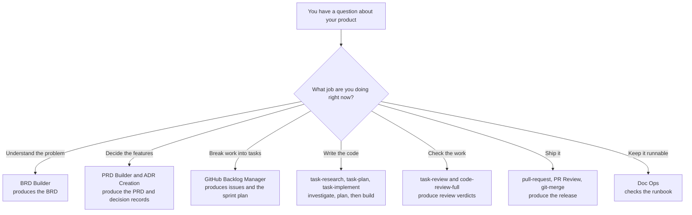

# Build your idea, one stage at a time

This is a **starter kit** for building software with Microsoft's
[HVE Core](https://microsoft.github.io/hve-core/) tooling. You bring an idea. You
copy this template, describe your idea in one document, and then follow nine
short pages that each tell you exactly what to click, what to paste, and what
file should appear.

You do not need to know anything about this repository, and you do not need to
have used AI coding tools before. You also do not need to have chosen a
programming language yet — that decision comes later, when you are ready for it.

Every stage is done by a **helper**: a specialist AI assistant inside GitHub
Copilot Chat. One helper writes requirements, another breaks work into tasks,
another writes code. You pick the right helper, paste the prompt we give you,
and check the result.

This page is the full story of the kit: what you will build, why the process
exists, how the nine stages fit together, how the helpers work, and what every
important folder is for. If a word is unfamiliar, open the
**[glossary](GLOSSARY.md)** — every term is explained in plain English.

---

## The story this kit is trying to tell

Imagine you have an idea for a small product. You open an AI chat and say "build
my app." Something appears. It looks impressive. A week later nobody remembers
why a database was chosen, a feature nobody asked for has quietly grown legs,
and "done" means "it ran once on my machine." The next person to touch the
project inherits a mystery.

That story is common with or without AI. Long before AI helpers existed, teams
already had a sensible sequence for building software:

```text
Set up the machine and the repository
   ↓
Discovery — understand the problem
   ↓
Product definition — decide what to build
   ↓
Decomposition — break it into tasks
   ↓
Sprint planning — decide what comes first
   ↓
Implementation — write the code
   ↓
Review — check the work
   ↓
Delivery — release it
   ↓
Operations — keep it running
```

Nothing controversial. Those nine steps are the nine stages of the HVE Core
lifecycle, and the nine stages in this kit.

The stages were never the problem. What broke was the discipline and the memory:
people skipped steps because coding felt more productive than thinking, and the
reasons behind decisions lived in someone's head or a chat window until they
evaporated. AI made that failure mode faster and more fluent — a general
assistant will happily invent the wrong thing with great confidence.

This kit is the antidote. Same nine stages you already half-knew. A specialist
helper for each one. Proof that lives in the repository, not in a chat that
disappears.

---

## What goes wrong, with or without AI

**Everything collapses into "just code it."** Discovery and planning feel slow;
typing code feels like progress. So people jump straight to the implementation
stage and invent features that were never agreed. Then a week is spent on
something nobody wanted.

**Knowledge lives in chat and in heads.** "We decided a simple file would do
instead of a database" is a real decision with real consequences. Next month
nobody remembers why, and the AI never knew.

**One general assistant does every job badly.** Ask a plain AI chat to "build my
app" and it tries to be analyst, product manager, architect, programmer, and
reviewer in a single breath. It optimises for producing something plausible, not
for producing something correct. It will not tell you it misunderstood — it will
simply build the wrong thing, fluently.

**"Done" means "it ran once on my machine."** Without written acceptance
criteria and a real review step, shipping is just hoping.

**The next person inherits a mystery.** No runbook, no record of decisions, so
restarting costs days.

---

## What this kit does about it

**A specialist for each stage.** Instead of one assistant doing everything, each
stage has a helper built for that job. `BRD Builder` will not start writing code.
`Task Implementor` will not redesign your product. Picking the right helper
matters more than the wording of your prompt.

**Important thinking becomes files, not chat.** Every stage writes a document
into the repository. Chat history disappears; those files do not. When the AI
needs context three weeks later, it reads them.

**The AI is forced to slow down at the right moments.** When writing code, it
must research and write down what it found, then write a plan, and only then
write code — with you reading each step before allowing the next. A
misunderstanding then costs you one paragraph of reading instead of three
hundred lines of wrong code.

**Scope is written down and pointed at constantly.** Your framing document lists
what is out of scope. Every prompt in this kit references it. That single habit
prevents the most common failure mode.

Building without this looks like: a messy chat, a half-remembered decision, a
burst of AI-generated code, and a shrug for "done".

Building with it looks like: the reasons written down where you can reread them,
a feature list that stops growing, tasks with clear finish lines, an AI that
investigates before it types, a review that asks whether the thing actually
works, and a runbook so the next person is not stranded.

---

## What you end up with

When you finish the nine stages, you do not only have code. You have a trail of
decisions that explains the code.

| You get | Where it lives |
| --- | --- |
| A working first version of your product | `src/` and `tests/` |
| A written record of the problem you set out to solve | `docs/brds/<name>-brd.md` |
| A list of features with clear "this is finished when…" rules | `docs/prds/<name>.md` |
| The technical decisions, and why you made them | `docs/decisions/` |
| The work split into small tasks, in a sensible order | Your tracker, plus `docs/planning/sprint-plan.md` |
| Proof it was reviewed before you called it done | `docs/reviews/` |
| What shipped and how it was checked | `docs/releases/` |
| A page telling the next person how to run it | `docs/operations/runbook.md` |

Those documents are the point. They are what stops the AI (and you) from quietly
building something nobody asked for.

---

## What you need before you start

- **VS Code** — the code editor
- **GitHub Copilot Chat** — signed in and working
- **HVE Core - All** — the extension that provides the helpers. [Install it here](https://marketplace.visualstudio.com/items?itemName=ise-hve-essentials.hve-core-all)
- **Git** — to copy this template and later save your work

This kit is written against **HVE Core - All version 3.3.101**. Helper names and
slash commands change between releases, so if a name on a stage page does not
match what you see, check your version first — Stage 1 shows you where.

You do **not** need to have chosen a programming language yet. You decide that in
Stage 3, and Stage 6 will tell you what to install before any code is written.

---

## How to copy this template

Open a terminal and run these four commands. Replace `<repo-url>` with this
repository's address, and `my-project` with whatever you want to call your
project.

```bash
git clone <repo-url> my-project
cd my-project
git checkout template
git checkout -b my-project-main
```

The last line creates your own branch so your work stays separate from the
template. Then open the `my-project` folder in VS Code.

---

## How the helpers work

Three kinds of thing appear in this kit:

| Kind | What it is | Everyday equivalent |
| --- | --- | --- |
| **Helper** (agent, or mode) | A version of Copilot Chat set up for one job | Calling the right colleague |
| **Slash command** | A focused routine you trigger by typing `/something` | Following a recipe card |
| **Instructions** | Coding rules that apply quietly in the background | House style on the wall |

Helpers and slash commands are less separate than they look. Most commands carry
a helper with them — typing `/task-plan` switches you to `Task Planner` without
touching the dropdown. Only a handful of helpers need picking by hand:
`BRD Builder`, `PRD Builder`, `ADR Creation`, and `PR Review`.

Either way, Copilot loads that one helper's instructions rather than trying to be
everything at once. Same question, different helper, completely different answer:



The stage picks the helper, and the helper decides what gets written.

---

## The one thing you write yourself

Everything in this kit flows from a single document:

**[lifecycle/02-discovery/mvp-framing.md](lifecycle/02-discovery/mvp-framing.md)**

You fill in that file with your idea — the problem, who it is for, and what is in
and out of scope. Every prompt after that reads it automatically, directly or
through what the previous stage produced. You never have to retype your product
name or paste your idea again.

Nothing else needs typing out twice. If you later change your mind about what you
are building, edit this framing document first, then work forward again from
Stage 2. That keeps the documents and the code from drifting apart.

---

## Where things live

Two folders matter, and they do different jobs.

**`lifecycle/` is the instructions.** Nine pages, one per stage, telling you which
helper to pick and what to paste. You read these; the helpers mostly do not.

**`docs/` is the product.** Everything the helpers produce that is worth keeping
lands here. `docs/brds/`, `docs/prds/`, and `docs/decisions/` are HVE Core's own
default locations, which is why the helpers find each other's work without being
told where to look. The rest belongs to this template.

| Stage | Reads | Writes |
| --- | --- | --- |
| 1 Setup | — | `.github/copilot-instructions.md` |
| 2 Discovery | `lifecycle/02-discovery/mvp-framing.md` | `docs/brds/<name>-brd.md` |
| 3 Product definition | the BRD | `docs/prds/<name>.md`, `docs/decisions/` |
| 4 Decomposition | the PRD and decision records | issues in your tracker |
| 5 Sprint planning | the backlog | `docs/planning/sprint-plan.md` |
| 6 Implementation | the sprint plan and issues | `src/`, `tests/`, evidence in `.copilot-tracking/` |
| 7 Review | everything above | `docs/reviews/` |
| 8 Delivery | the reviews | `docs/releases/`, the tag `v0.1.0` |
| 9 Operations | the code and ADRs | `docs/operations/runbook.md` |

One stage's output is the next one's input. That is why skipping a stage breaks
the one after it — the helper opens the file it was told to read, finds nothing,
and either stops or starts inventing.

Or, in the shorter chain of ideas:

```text
your idea → the problem → the features → the tasks → the order
   → the code → the verdict → the release → the runbook
```

Going backwards is fine and expected. If a review finds a problem, return to
Stage 6. If you change your mind about what you are building, edit the framing
document and work forward from Stage 2 again. That is the process working, not
failing.

---

## How each stage page works

Every one of the nine pages has the same shape, so once you have done one you can
do them all:

1. What this stage is for
2. Prerequisites — things that must already exist
3. Pick the helper — the exact name to choose in the Copilot dropdown
4. Paste this prompt — copy the block exactly, change nothing
5. What you should see afterwards — the file that should now exist
6. If the helper asks you a question — how to answer
7. Done when — what must be true before you move on, then a link to the next stage

Work top to bottom. Do not skip ahead.

---

## The nine stages

| # | Stage | In plain words | Helper or command | What you end up with |
| --- | --- | --- | --- | --- |
| 1 | [Setup](lifecycle/01-setup/README.md) | Install the helpers and check they appear | *(by hand, plus `/git-setup`)* | Helpers working, `.github/copilot-instructions.md` filled in |
| 2 | [Discovery](lifecycle/02-discovery/README.md) | Turn your idea into a clear statement of the problem | `BRD Builder` | A BRD in `docs/brds/` |
| 3 | [Product definition](lifecycle/03-product-definition/README.md) | Decide the features, and lock the big technical choices | `PRD Builder`, `ADR Creation` | A PRD in `docs/prds/`, decision records in `docs/decisions/` |
| 4 | [Decomposition](lifecycle/04-decomposition/README.md) | Break the features into small tasks | `/github-discover-issues`, `/github-execute-backlog` | Issues in your tracker |
| 5 | [Sprint planning](lifecycle/05-sprint-planning/README.md) | Put the tasks in order; pick what to build first | `/github-sprint-plan` | `docs/planning/sprint-plan.md` |
| 6 | [Implementation](lifecycle/06-implementation/README.md) | Build it, one task at a time | `/task-research`, `/task-plan`, `/task-implement`, `/task-review` | Code in `src/` and `tests/`, one closed issue per task |
| 7 | [Review](lifecycle/07-review/README.md) | Check the result against what you promised | `/task-review`, `/code-review-full` | Verdicts in `docs/reviews/` |
| 8 | [Delivery](lifecycle/08-delivery/README.md) | Publish your first release | `/pull-request`, `PR Review`, `/git-merge` | Tag `v0.1.0` and notes in `docs/releases/` |
| 9 | [Operations](lifecycle/09-operations/README.md) | Write the page that tells people how to run it | `/doc-ops-update` | `docs/operations/runbook.md` |

### Stage 1 — Setup

You install the HVE Core - All extension, confirm the helpers appear in the
Copilot Chat dropdown, run `/git-setup`, check the folders exist, and record your
project's name in `.github/copilot-instructions.md`. That last file is read by
every helper on every request — it is how a template becomes your project. No
requirements yet. No code yet.

### Stage 2 — Discovery

You already wrote your framing document. Now `BRD Builder` turns that into a
**BRD**: a short write-up of *why* you are building this — the problem, who has
it, what success looks like. It deliberately does not talk about features or
technology yet. Thinking before shopping.

If your domain needs it, this is also where `Security Planner`, `RAI Planner`, or
`SSSC Planner` do their work.

### Stage 3 — Product definition

Two helpers, two jobs. `PRD Builder` writes the **PRD**: the list of features as
user stories, each with acceptance criteria ("this is finished when…") and an id
so later stages can point back at it. `ADR Creation` records the big technical
choices as **decision records** — short notes explaining what you chose, why,
what it costs you, and when you would change your mind. It gets there by asking
you questions rather than filling in a form. This is where the programming
language, the data storage, and the test command get decided, and where you copy
them into `.github/copilot-instructions.md`.

### Stage 4 — Decomposition

`/github-discover-issues` reads the PRD and **proposes** a backlog of small
tasks, each carrying the acceptance criterion ids it came from. You read that
proposal, and only then does `/github-execute-backlog` create the issues. That
thread from criterion to task is what makes Stage 7 possible. Azure DevOps and
Jira have their own equivalents; the stage page covers all three, and a
plain-file fallback if you use no tracker at all.

### Stage 5 — Sprint planning

`/github-sprint-plan` orders those tasks and picks what to build first. This kit
defaults to two sprints: Sprint 1 builds a **thin vertical slice** (the smallest
end-to-end path a real person could actually use), and Sprint 2 hardens it. You
leave with a sprint plan and a definition of done for each.

### Stage 6 — Implementation

This is the long stage. You build **one task at a time**, and each task passes
through four phases. Each phase is its own command, and each command brings its
own specialist:

1. **Research** — `/task-research`. The AI investigates and writes down what it found. No code yet.
2. **Plan** — `/task-plan`. It writes a plan and the phase details, then checks its own plan and logs the discrepancies. Still no code.
3. **Implement** — `/task-implement`. Only then does it write code, under `src/` and `tests/`.
4. **Review** — `/task-review`. The tests are run and the work is checked against what the task promised.

Clear the chat between every phase. Each phase writes what it learned to a file
under `.copilot-tracking/`, and you hand that file's path to the next command —
so nothing is lost, and a clean chat keeps the AI working from the evidence
rather than from a long, drifting conversation.

Do not start a task's Plan before its Research exists, and do not start the next
task before the current one's review has passed and its issue is closed. You
track that in `lifecycle/06-implementation/task-log.md`.

### Stage 7 — Review

"It runs on my machine" is not the same as "it does what we agreed." First
`/task-review` asks whether each sprint as a whole matches the PRD and the
definition of done. Then `/code-review-full` asks whether the code itself is
sound, running functional and standards reviews over the branch diff and merging
them into one report. If your product touches anything sensitive,
`/security-review` adds an OWASP assessment. Problems found here become written
defects and follow-ups — not quiet fixes that nobody remembers.

### Stage 8 — Delivery

You record the release evidence, open a pull request with `/pull-request`, review
it with the `PR Review` helper, then merge and tag `v0.1.0` with `/git-merge`,
and write release notes saying what shipped, what was checked, and what was
deliberately left out.

### Stage 9 — Operations

You write the **runbook**: how to start the app, where its data lives, and what
to do when it breaks. Then `/doc-ops-update` checks it against the repository,
because the way a runbook fails is by quoting a command that no longer works.
Written last, appreciated forever by the next person (including future you). When
something does break later, `/incident-response` works the incident and the fix
goes back through Stage 6.

---

## `.copilot-tracking/` — the helpers' workbench

Think of `.copilot-tracking/` as the helpers' **scratch pad and evidence folder**.
It is not where your product story lives — that is `docs/`. It is where the AI
helpers automatically save working notes while they research, plan, implement,
and review.

| Who | How they use it |
| --- | --- |
| **You** | Almost never by hand. You read the files the stage pages point you at, but you do not write here. |
| **The task helpers (Stage 6)** | Write research, plans, phase details, change records, and review logs here — one dated file per phase, per task. |
| **BRD and PRD Builder** | Keep session state here, which is how they resume a conversation you started yesterday. |
| **GitHub Backlog Manager** | Drafts the backlog and the sprint plan here before anything touches your tracker. |
| **Review helpers (Stages 7 and 8)** | Read it on purpose, to compare what was promised with what actually changed. |

Three rules:

1. **Leave it alone while a project is in flight.** Stage 7 reads it. Emptying it to "tidy up" throws away the evidence the review is supposed to read.
2. **It is not committed by default.** HVE Core treats it as working evidence, and this template's `.gitignore` follows that. Anything you will still want in six months belongs in `docs/`, which is why Stages 7 and 8 write committed summaries there. If your team wants the raw trail in Git, delete the `.copilot-tracking/` lines from `.gitignore`.
3. **Do not cite its paths in code, comments, or commit messages.** That is an HVE Core convention and the helpers follow it.

In short: **you own `lifecycle/`, the helpers own `.copilot-tracking/`, and
`docs/` is what you keep.**

---

## What is in this repository

```text
.
├── README.md                    # This guide — the full story of the kit
├── GLOSSARY.md                  # Plain-English definitions of every term
├── .github/
│   ├── copilot-instructions.md  # Your project's conventions. Every helper reads this.
│   └── ISSUE_TEMPLATE/          # The shape Stage 4 gives each task
├── lifecycle/                   # The nine stage pages. Start here.
│   ├── 01-setup/ … 09-operations/
├── docs/                        # Everything the helpers produce that is worth keeping
│   ├── brds/                    # The business requirements document
│   ├── prds/                    # The product requirements document
│   ├── decisions/               # Decision records (ADRs)
│   ├── planning/                # The sprint plan
│   ├── reviews/                 # Stage 7 verdicts
│   ├── releases/                # Release evidence and notes
│   └── operations/              # Runbook, and incidents if you have any
├── src/                         # Your application code (created in Stage 6)
├── tests/                       # Your tests (created in Stage 6)
├── scripts/                     # Helper scripts, if you need any
└── .copilot-tracking/           # Working notes the AI helpers save automatically
```

---

## Why the order matters

Each stage reads what the previous one wrote. Skip a stage and the next one has
nothing to read. It will either stop, or — worse — invent what it thinks should
have been there. That invention is silent, confident, and usually wrong.

The order is not bureaucracy. It is a conveyor belt of context: each helper only
has to do one job because the previous helper already wrote down the answer to
the previous question.

---

## The rules that keep this working

- **One helper per job.** Do not ask the coding helper to write requirements, or the requirements helper to write code.
- **Do not skip stages.** Each stage reads what the previous stage produced.
- **The files are the truth, not the chat.** Chat history disappears. The documents in `docs/` are what you and the AI come back to.
- **If it is not in your framing document, it is not in scope.** When you want to add something, edit the framing document first.
- **Pass each phase the path the previous one gave you.** The four task commands chain by file path, and a typo there is the usual reason a phase says it cannot find anything.

---

## The mistakes worth avoiding

1. **Using the coding helper to write requirements.** Wrong specialist. It will produce something that looks like a requirements document and reads like a technical design.
2. **Using a requirements helper to write code.** Same mistake, other direction. Finish the definition stages first.
3. **Building polish before the core works.** Your first sprint should be one thin path that a person could actually use, end to end. Beautiful settings screens attached to nothing are the classic trap.
4. **Running `/task-implement` without reading the plan.** The gate is the whole point. Skipping it costs you the thing the kit exists to give you.
5. **Letting scope grow quietly.** Every "while we're here, let's also…" costs you the release. If you want it, edit the framing document first and see how you feel about it in writing.
6. **Ticking a review box you did not check.** The reviews only protect you if you are honest in them.

---

## If something goes wrong

| What you see | What to do |
| --- | --- |
| The helper name is not in the Copilot dropdown | The HVE Core - All extension is not installed or VS Code was not reloaded. Install it, then reload VS Code. |
| A `/task-*` command is not offered, but `/rpi-research` and `/rpi-plan` are | Your HVE Core is newer than the 3.3.101 this kit targets, and the four phases were renamed. The phases themselves are unchanged: read `/rpi-research` for `/task-research`, and so on. |
| Some commands appear but many do not | You may have installed the smaller **HVE Core** package instead of **HVE Core - All**. |
| The helper asks you a question you cannot answer | Look for the answer in your [framing document](lifecycle/02-discovery/mvp-framing.md). If it is not there, decide now, tell the helper, and add the answer to the framing document so it is not lost. |
| The helper invents a feature you never asked for | Reply: "That is out of scope. Use only what is in `lifecycle/02-discovery/mvp-framing.md`." Scope creep is the most common way these projects fail. |
| A phase says the previous phase's file is missing | Check the path you passed in `research=` or `plan=`. The phases chain by explicit file path, so a typo there looks exactly like a skipped phase. |
| Stage 4 says it cannot reach your repository | The GitHub MCP server is not connected in VS Code. The backlog helper works entirely through it. |
| The helper writes to a different path than the stage page predicted | Take the path it reports and note it in your setup confirmation. HVE Core owns the `docs/brds/`, `docs/prds/`, and `docs/decisions/` locations and can move them between releases. |
| Stage 7 cannot find research or change evidence | Confirm `.copilot-tracking/` still has it from Stage 6. `Task Reviewer` needs the plan and changes logs and will stop without them, so do not empty that folder before review. |

Three ways people most often get stuck:

1. **Skipping a stage.** Each stage reads the previous stage's output. If it is missing, the helper has nothing to work from.
2. **Adding features mid-way.** If you want something new, edit [mvp-framing.md](lifecycle/02-discovery/mvp-framing.md) first, then continue. Otherwise the documents and the code drift apart.
3. **Trusting the chat instead of the files.** Chat history disappears. If it matters, it belongs in a file under `docs/`.

---

## Words you will see

Terms like BRD, PRD, ADR, backlog, sprint, RPI, thin vertical slice, and runbook
are all explained in plain English in the **[glossary](GLOSSARY.md)**. You do not
need to memorise them — come back when a stage page uses a word you do not
recognise.

---

## Ready?

Start with **[Stage 1 — Setup](lifecycle/01-setup/README.md)**.

Then write your idea into
**[lifecycle/02-discovery/mvp-framing.md](lifecycle/02-discovery/mvp-framing.md)**
— the only document you write by hand — and walk the nine stages top to bottom.
