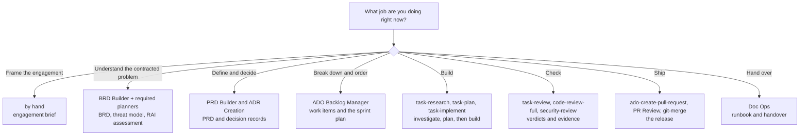

# HVE for delivery engagements

A repository template for engineers who drop into a customer's environment for a fixed period, build something with them, and leave behind a system they can maintain.

It wraps Microsoft's [HVE Core](https://microsoft.github.io/hve-core/) tooling in a sequence of stage pages: which helper to pick, what to paste, what should appear, and what has to be true before you move on. The HVE lifecycle is unchanged — this variant supplies the engagement context around it.

Targets **HVE Core - All 3.3.101**.

---

## Two variants

This repository has two branches for two different situations.

| Branch | For | Assumes |
| --- | --- | --- |
| `learning-template` | Learning HVE, or your own product | New codebase, you decide the scope, GitHub, solo |
| `master` *(this one)* | A customer engagement | Existing codebase, contracted scope, Azure DevOps, a team you are enabling and a last day |

The stages are the same nine. What differs is who decides scope, whose repository you are in, what "done" means, and who has to be able to run it after you leave.

If you are new to HVE, read the course variant first. It explains the machinery in more detail. This one assumes you know it and concentrates on what the engagement context adds.

---

## What is different about delivery work

The standard lifecycle quietly assumes you own the product. On an engagement you do not, and five things change as a result.

**Scope arrives, it does not emerge.** Someone sold this work. Your discovery stage reconciles a statement of work with reality and surfaces its ambiguities — it does not invent a product. Stage 2 is reframed accordingly.

**The codebase is already there.** You are adding to a system with its own conventions, its own history, and its own reasons for things that look wrong at first glance. The research phase in Stage 6 stops being a hedge against AI invention and becomes how you learn a codebase you did not write.

**The deadline is fixed and external.** You plan backwards from a last day you did not choose. Stage 5 does the arithmetic honestly and asks what genuinely fits.

**Compliance is not optional.** Security, Responsible AI, and supply-chain reviews are obligations you inherit from the engagement, not extras you run if you feel like it. Stage 0 records which apply and Stages 2 and 7 enforce them.

**Handover is the deliverable.** The measure of the engagement is not what you built but what the customer's engineers can build next month without you. That is why Stage 9 is enablement rather than documentation, and why it starts an iteration before the end.

---

## Stage 0

The nine HVE stages describe how a product gets built. They do not describe how an engagement starts and ends, so this variant adds one stage in front of them.

**[Stage 0 — Engagement framing](lifecycle/00-engagement/README.md)** produces the engagement brief: the window, the people, the exit criteria, what you are inheriting, and which compliance obligations apply. Later stages read it, and several of them behave differently depending on what it says.

The nine keep their usual numbers, so the mapping back to HVE Core stays intact.

---

## The stages

| # | Stage | What it does here | Helper or command | Output |
| --- | --- | --- | --- | --- |
| 0 | [Engagement framing](lifecycle/00-engagement/README.md) | Boundaries, people, exit criteria, obligations | *(by hand)* | `lifecycle/00-engagement/engagement-brief.md` |
| 1 | [Setup](lifecycle/01-setup/README.md) | Tooling, and getting this scaffolding into their repository | *(by hand, plus `/git-setup`)* | `.github/copilot-instructions.md` with the inherited stack |
| 2 | [Discovery](lifecycle/02-discovery/README.md) | Turn the statement of work into a BRD, ambiguities intact | `BRD Builder`, plus required planners | `docs/brds/`, plus threat model and RAI assessment where required |
| 3 | [Product definition](lifecycle/03-product-definition/README.md) | Features with acceptance criteria; decisions, including inherited ones | `PRD Builder`, `ADR Creation` | `docs/prds/`, `docs/decisions/` |
| 4 | [Decomposition](lifecycle/04-decomposition/README.md) | Propose a backlog, have the customer review it, then create it | `/ado-discover-work-items`, `/ado-update-wit-items` | Work items in their tracker |
| 5 | [Sprint planning](lifecycle/05-sprint-planning/README.md) | Plan backwards from the last day; reserve the final iteration | `/ado-sprint-plan` | `docs/planning/sprint-plan.md` |
| 6 | [Implementation](lifecycle/06-implementation/README.md) | Four-phase loop per task, inside their conventions | `/task-research`, `/task-plan`, `/task-implement`, `/task-review` | Code, evidence, closed work items |
| 7 | [Review](lifecycle/07-review/README.md) | Acceptance, code, security, RAI — then demo | `/task-review`, `/code-review-full`, `/security-review` | `docs/reviews/` |
| 8 | [Delivery](lifecycle/08-delivery/README.md) | Ship through their process; the PR is where enablement happens | `/ado-create-pull-request`, `PR Review`, `/git-merge` | `docs/releases/`, a tag |
| 9 | [Handover](lifecycle/09-operations/README.md) | Runbook, handover document, and engineers who can work unaided | `/doc-ops-update` | `docs/operations/`, exit criteria signed off |

Stages 6, 7, and 8 loop once per iteration. Reach Stage 9 only in your last one — and start it before then.

---

## What you leave behind

| Artefact | Where | Who needs it after you go |
| --- | --- | --- |
| The working system | Their repository | Everyone |
| Why it exists | `docs/brds/` | The next product owner |
| What was agreed, with acceptance criteria | `docs/prds/` | Whoever disputes scope later |
| Why it is built this way, inherited and chosen | `docs/decisions/` | The engineer who wants to change it |
| What was reviewed and what was deferred | `docs/reviews/` | Their security and engineering leads |
| What shipped and how it was checked | `docs/releases/` | Audit, and the next engagement |
| How to run it | `docs/operations/runbook.md` | Whoever is on call |
| What was not delivered, and where it is weak | `docs/operations/handover.md` | Their engineering lead |

The handover document is the one people skip and the one that gets read most.

---

## Before you start

- **VS Code**, **GitHub Copilot Chat**, and **Git**
- **HVE Core - All** — [from the marketplace](https://marketplace.visualstudio.com/items?itemName=ise-hve-essentials.hve-core-all), or via HVE Core's installer skill if the customer blocks extensions
- **The MCP server for their tracker**, connected and authenticated. Stages 4 and 5 do not work without it, and access requests in customer tenants are slow — start that on day one
- Whatever their codebase needs to build and test locally

Helper names and commands move between HVE Core releases. If a stage page does not match what you see, check your version first; Stage 1 shows you where.

---

## Getting started

```bash
git clone <repo-url> <engagement-name>
cd <engagement-name>
git checkout master
```

Then read [Stage 0](lifecycle/00-engagement/README.md) and fill in the engagement brief. [Stage 1](lifecycle/01-setup/README.md) covers both cases for where the code lives: copying this scaffolding into an existing customer repository, which is the common one, or starting a new repository for the engagement.

---

## How the helpers work

| Kind | What it is |
| --- | --- |
| **Helper** (agent, or mode) | Copilot Chat configured for one job |
| **Slash command** | A focused routine invoked with `/something` |
| **Instructions** | Conventions applied quietly in the background |

Most commands carry their own helper — `/task-plan` switches you to `Task Planner` without touching the dropdown. Only `BRD Builder`, `PRD Builder`, `ADR Creation`, `PR Review`, and the Stage 2 planners need picking by hand.



The customer's tracker decides whether you use the `/ado-*` or `/github-*` family. Use whatever they already run; introducing a second tracker for the duration of an engagement guarantees half the history is lost at handover.

---

## Where things live

**`lifecycle/`** is the process. You read it; the helpers mostly do not.

**`docs/`** is what the customer keeps. `docs/brds/`, `docs/prds/`, and `docs/decisions/` are HVE Core's own default locations, which is how the helpers find each other's work without being told. The rest belongs to this template.

**`.copilot-tracking/`** is the helpers' workbench: research, plans, change records, review logs, and backlog drafts. Three rules:

1. **Leave it alone while the engagement is live.** Stage 7 reads it. Emptying it to tidy up throws away the evidence the review needs.
2. **It is not committed.** Anything that must survive your departure belongs in `docs/`, which is why Stages 7, 8, and 9 write committed summaries there.
3. **Do not cite its paths** in code, comments, commit messages, or work item comments. That is an HVE Core convention and the helpers follow it.

```text
.
├── README.md
├── GLOSSARY.md
├── .github/
│   ├── copilot-instructions.md   # Conventions and the inherited stack. Every helper reads this.
│   └── ISSUE_TEMPLATE/
├── lifecycle/
│   ├── 00-engagement/            # The engagement brief
│   ├── 01-setup/ … 09-operations/
├── docs/
│   ├── brds/  prds/  decisions/  # HVE Core's default locations
│   ├── planning/                 # Sprint plan
│   ├── reviews/                  # Acceptance, code, security, RAI
│   ├── releases/                 # Evidence and notes
│   └── operations/               # Runbook, handover, incidents
└── .copilot-tracking/            # Working evidence, not committed
```

In an existing repository the application code stays wherever it already lives. Record its real paths in `.github/copilot-instructions.md` rather than creating `src/` and `tests/` alongside their equivalents.

---

## The rules that keep this working

- **One helper per job.** The coding helper does not write requirements, and the requirements helper does not write code.
- **The files are the truth, not the chat.** Your chat history leaves with you.
- **If it is not in the scope framing, it is not in scope.** When scope legitimately changes, change [`scope-framing.md`](lifecycle/02-discovery/scope-framing.md) first and work forward from Stage 2.
- **Product questions go to the customer; technical questions are yours.** That line is the difference between delivery and outsourcing.
- **Pass each phase the path the previous one produced.** The four task commands chain by explicit file path.
- **Never surprise the customer's tracker.** Propose, have them review, then create.
- **Write every artefact for the engineer who inherits it**, not for yourself and not for your lead.

---

## The mistakes that cost engagements

1. **Treating the statement of work as a starting point rather than a boundary.** Every addition is unpaid, and the last one lands in your final week.
2. **Leaving enablement until the end.** Someone shown the loop once in the last week cannot use it. Someone who has run it eight times can.
3. **Merging your own pull requests unopposed.** If their engineers are not really reviewing, handover has already failed and nobody has told you.
4. **Restructuring code the work did not require.** It makes review harder, it makes handover worse, and it is not yours to tidy.
5. **Discovering the scope does not fit in week eight.** Do the arithmetic in Stage 5 and raise it while cutting something is still a choice.
6. **A handover document that reads as a success story.** The weak points section is the part that gets read.
7. **Letting an unanswered question become your assumption.** Your assumption is not what anyone signed.

---

## If something goes wrong

| What you see | What to do |
| --- | --- |
| A helper is missing from the dropdown | HVE Core - All is not installed, or VS Code was not reloaded |
| `/rpi-research` and `/rpi-plan` appear instead of `/task-*` | Your HVE Core is newer than 3.3.101. The four phases are unchanged; only the names moved |
| Some commands appear but many do not | You may have the smaller **HVE Core** package rather than **HVE Core - All** |
| Stage 4 cannot reach their tracker | The MCP server is not connected or not authenticated against their organisation |
| A helper asks something you cannot answer | If it is technical, decide it and record it. If it is about scope or behaviour, it belongs in section 6 of [`scope-framing.md`](lifecycle/02-discovery/scope-framing.md) and goes to the customer |
| A helper invents scope | "That is out of scope. Use only what is in `lifecycle/02-discovery/scope-framing.md`" |
| A phase says the previous phase's file is missing | Check the path in `research=` or `plan=`. A typo looks exactly like a skipped phase |
| A helper writes to a path the stage page did not predict | Take the path it reports and record it in your setup confirmation. HVE Core owns the `docs/brds/`, `docs/prds/`, and `docs/decisions/` locations and can move them between releases |
| Stage 7 cannot find research or change evidence | `.copilot-tracking/` was emptied. `Task Reviewer` needs the plan and changes logs and will stop without them |
| The customer's policy blocks the extension | Use HVE Core's installer skill to commit the prompts and agents into the repository instead |

---

## Words you will see

BRD, PRD, decision record, thin vertical slice, RPI, exit criteria, brownfield, and the rest are defined in the **[glossary](GLOSSARY.md)**.

---

## Start

**[Stage 0 — Engagement framing](lifecycle/00-engagement/README.md)**, then work down. The two documents you write by hand are [`engagement-brief.md`](lifecycle/00-engagement/engagement-brief.md) and [`scope-framing.md`](lifecycle/02-discovery/scope-framing.md). Everything else is produced by a helper and checked by you.
