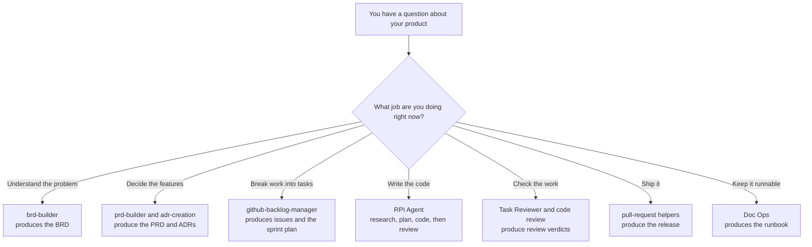

# Build your idea, one stage at a time

This is a **starter kit**. You bring an idea. You copy this template, describe your idea in one document, and then follow nine short pages that each tell you exactly what to click, what to paste, and what file should appear.

You do not need to know anything about this repository, and you do not need to have used AI coding tools before. You also do not need to have chosen a programming language yet — that decision comes later, when you are ready for it.

Every stage is done by a **helper**: a specialist AI assistant inside GitHub Copilot Chat. One helper writes requirements, another breaks work into tasks, another writes code. You pick the right helper, paste the prompt we give you, and check the result.

This page is the full story of the kit: what you will build, why the process exists, how the nine stages fit together, how the helpers work, and what every important folder is for. If a word is unfamiliar, open the **[glossary](GLOSSARY.md)** — every term is explained in plain English.

---

## The story this kit is trying to tell

Imagine you have an idea for a small product. You open an AI chat and say "build my app." Something appears. It looks impressive. A week later nobody remembers why a database was chosen, a feature nobody asked for has quietly grown legs, and "done" means "it ran once on my machine." The next person to touch the project inherits a mystery.

That story is common with or without AI. Long before AI helpers existed, teams already had a sensible sequence for building software:

```text
Set up the machine and the repository
   ↓
Discovery — understand the problem
   ↓
Product definition — decide what to build
   ↓
Decomposition — break it into tasks
   ↓
Sprint planning — decide what comes first
   ↓
Implementation — write the code
   ↓
Review — check the work
   ↓
Delivery — release it
   ↓
Operations — keep it running
```

Nothing controversial. Those nine steps are the nine stages in this kit.

The stages were never the problem. What broke was the discipline and the memory: people skipped steps because coding felt more productive than thinking, and the reasons behind decisions lived in someone's head or a chat window until they evaporated. AI made that failure mode faster and more fluent — a general assistant will happily invent the wrong thing with great confidence.

This kit is the antidote. Same nine stages you already half-knew. A specialist helper for each one. Proof that lives in the repository, not in a chat that disappears.

---

## What goes wrong, with or without AI

**Everything collapses into "just code it."** Discovery and planning feel slow; typing code feels like progress. So people jump straight to the implementation stage and invent features that were never agreed. Then a week is spent on something nobody wanted.

**Knowledge lives in chat and in heads.** "We decided a simple file would do instead of a database" is a real decision with real consequences. Next month nobody remembers why, and the AI never knew.

**One general assistant does every job badly.** Ask a plain AI chat to "build my app" and it tries to be analyst, product manager, architect, programmer, and reviewer in a single breath. It optimises for producing something plausible, not for producing something correct. It will not tell you it misunderstood — it will simply build the wrong thing, fluently.

**"Done" means "it ran once on my machine."** Without written acceptance criteria and a real review step, shipping is just hoping.

**The next person inherits a mystery.** No runbook, no record of decisions, so restarting costs days.

---

## What this kit does about it

**A specialist for each stage.** Instead of one assistant doing everything, each stage has a helper built for that job. `brd-builder` will not start writing code. `RPI Agent` will not redesign your product. Picking the right helper matters more than the wording of your prompt.

**Important thinking becomes files, not chat.** Every stage writes a document into `lifecycle/`. Chat history disappears; those files do not. When the AI needs context three weeks later, it reads them.

**The AI is forced to slow down at the right moments.** When writing code, it must research and write down what it found, then write a plan, and only then write code — with you reading each step before allowing the next. A misunderstanding then costs you one paragraph of reading instead of three hundred lines of wrong code.

**Scope is written down and pointed at constantly.** Your framing document lists what is out of scope. Every prompt in this kit references it. That single habit prevents the most common failure mode.

Building without this looks like: a messy chat, a half-remembered decision, a burst of AI-generated code, and a shrug for "done".

Building with it looks like: the reasons written down where you can reread them, a feature list that stops growing, tasks with clear finish lines, an AI that investigates before it types, a review that asks whether the thing actually works, and a runbook so the next person is not stranded.

---

## What you end up with

When you finish the nine stages, you do not only have code. You have a trail of decisions that explains the code.

| You get | Where it lives |
| --- | --- |
| A working first version of your product | `src/` and `tests/` |
| A written record of the problem you set out to solve | `lifecycle/02-discovery/output/` |
| A list of features with clear "this is finished when…" rules | `lifecycle/03-product-definition/output/` |
| The work split into small tasks, in a sensible order | `lifecycle/04-decomposition/` and `lifecycle/05-sprint-planning/` |
| Proof it was reviewed before you called it done | `lifecycle/07-review/output/` |
| A page telling the next person how to run it | `lifecycle/09-operations/output/runbook.md` |

Those documents are the point. They are what stops the AI (and you) from quietly building something nobody asked for.

---

## What you need before you start

- **VS Code** — the code editor
- **GitHub Copilot Chat** — signed in and working
- **HVE Core - All** — the extension that provides the helpers. [Install it here](https://marketplace.visualstudio.com/items?itemName=ise-hve-essentials.hve-core-all)
- **Git** — to copy this template and later save your work

You do **not** need to have chosen a programming language yet. You decide that in Stage 3, and Stage 6 will tell you what to install before any code is written.

---

## How to copy this template

Open a terminal and run these four commands. Replace `<repo-url>` with this repository's address, and `my-project` with whatever you want to call your project.

```bash
git clone <repo-url> my-project
cd my-project
git checkout template
git checkout -b my-project-main
```

The last line creates your own branch so your work stays separate from the template. Then open the `my-project` folder in VS Code.

---

## How the helpers work

Three kinds of thing appear in this kit:

| Kind | What it is | Everyday equivalent |
| --- | --- | --- |
| **Helper** (agent, or mode) | A version of Copilot Chat set up for one job. Pick it from the dropdown. | Calling the right colleague |
| **Slash command** | A focused routine you trigger by typing `/something` | Following a recipe card |
| **Instructions** | Coding rules that apply quietly in the background | House style on the wall |

When you pick a helper and send a prompt, Copilot loads that helper's instructions rather than trying to be everything at once. Same question, different helper, completely different answer:



The stage picks the helper, and the helper decides what gets written.

---

## The one thing you write yourself

Everything in this kit flows from a single document:

**[lifecycle/02-discovery/input/mvp-framing.md](lifecycle/02-discovery/input/mvp-framing.md)**

You fill in that file with your idea — the problem, who it is for, and what is in and out of scope. Every prompt after that reads it automatically, directly or through what the previous stage produced. You never have to retype your product name or paste your idea again.

Nothing else needs typing out twice. If you later change your mind about what you are building, edit this framing document first, then work forward again from Stage 2. That keeps the documents and the code from drifting apart.

---

## Where you spend your time: the `lifecycle/` folder

This folder is the workshop. Each stage is one step of building your product, and each stage has the same shape:

| Path | What it holds |
| --- | --- |
| `README.md` | The page telling you what to do — which helper to pick and what to paste. **Start here.** (Stage 1 uses `input/setup-checklist.md` instead.) |
| `input/` | What the stage reads. Usually the previous stage's output, so usually nothing for you to do. |
| `output/` | What the stage produces. Empty until you run it. |

One stage's output is the next one's input. That is why skipping a stage breaks the one after it — the helper opens the file it was told to read, finds nothing, and either stops or starts inventing.

```text
mvp-framing.md
   → brd.md
      → prd.md + adr/
         → backlog-snapshot.md
            → sprint-plan.md
               → code + one notes folder per task
                  → reviews
                     → release notes + tag
                        → runbook.md
```

Or, in the shorter chain of ideas:

```text
your idea → the problem → the features → the tasks → the order
   → the code → the verdict → the release → the runbook
```

Going backwards is fine and expected. If a review finds a problem, return to Stage 6. If you change your mind about what you are building, edit the framing document and work forward from Stage 2 again. That is the process working, not failing.

---

## How each stage page works

Every one of the nine pages has the same shape, so once you have done one you can do them all:

1. What this stage is for
2. Before you start — things that must already exist
3. Pick the helper — the exact name to choose in the Copilot dropdown
4. Paste this prompt — copy the block exactly, change nothing
5. What you should see afterwards — the file path that should now exist
6. If the helper asks you a question — how to answer
7. Done when — what must be true before you move on, then a link to the next stage

Work top to bottom. Do not skip ahead.

---

## The nine stages

| # | Stage | In plain words | Helper | What you end up with | Open this page |
| --- | --- | --- | --- | --- | --- |
| 1 | Setup | Install the helpers and check they appear | *(by hand)* | `01-setup/output/setup-confirmation.md` | [setup-checklist.md](lifecycle/01-setup/input/setup-checklist.md) |
| 2 | Discovery | Turn your idea into a clear statement of the problem | `brd-builder` | `02-discovery/output/brd.md` | [Stage 2](lifecycle/02-discovery/README.md) |
| 3 | Product definition | Decide the features, and lock the big technical choices | `prd-builder`, `adr-creation` | `03-product-definition/output/prd.md` and `output/adr/` | [Stage 3](lifecycle/03-product-definition/README.md) |
| 4 | Decomposition | Break the features into small tasks | `github-backlog-manager` | GitHub issues and `04-decomposition/output/backlog-snapshot.md` | [Stage 4](lifecycle/04-decomposition/README.md) |
| 5 | Sprint planning | Put the tasks in order; pick what to build first | `github-backlog-manager` | `05-sprint-planning/output/sprint-plan.md` | [Stage 5](lifecycle/05-sprint-planning/README.md) |
| 6 | Implementation | Build it, one task at a time | `RPI Agent` | Code in `src/`, plus a folder of notes per task under `06-implementation/output/` | [Stage 6](lifecycle/06-implementation/README.md) |
| 7 | Review | Check the result against what you promised | `Task Reviewer`, `Functional code-review` | Reviews in `07-review/output/` | [Stage 7](lifecycle/07-review/README.md) |
| 8 | Delivery | Publish your first release | default Copilot Chat | Tag `v0.1.0` and `08-delivery/output/v0.1.0-release-notes.md` | [Stage 8](lifecycle/08-delivery/README.md) |
| 9 | Operations | Write the page that tells people how to run it | `Doc Ops` | `09-operations/output/runbook.md` | [Stage 9](lifecycle/09-operations/README.md) |

### Stage 1 — Setup

You install the HVE Core - All extension, confirm the helpers appear in the Copilot Chat dropdown, check that the important folders exist, and confirm Git works on your own branch. You fill in a short confirmation file when you are done. No requirements are written yet. No code is written yet.

### Stage 2 — Discovery

You already wrote your framing document. Now `brd-builder` turns that into a **BRD**: a short write-up of *why* you are building this — the problem, who has it, what success looks like. It deliberately does not talk about features or technology yet. Thinking before shopping.

### Stage 3 — Product definition

Two helpers, two jobs. `prd-builder` writes the **PRD**: the list of features as user stories, each with acceptance criteria ("this is finished when…"). `adr-creation` records the big technical choices as **ADRs** — short notes explaining what you chose, why, what it costs you, and when you would change your mind. This is also where the programming language and major tools get decided.

### Stage 4 — Decomposition

`github-backlog-manager` breaks the features into small tasks (GitHub issues) and saves a **backlog snapshot** in the repository so the work is readable without opening GitHub. Big ideas become bite-sized work.

### Stage 5 — Sprint planning

The same backlog helper orders those tasks and picks what to build first. This kit typically uses two sprints: Sprint 1 builds a **thin vertical slice** (the smallest end-to-end path a real person could actually use), and Sprint 2 hardens it. You leave with a sprint plan and a clear definition of done.

### Stage 6 — Implementation

This is the long stage. You build **one task at a time** with `RPI Agent`. Each task passes through four phases in this order:

1. **Research** — the AI investigates and writes down what it found (`research.md`). No code yet.
2. **Plan** — the AI writes a plan you can read (`plan.md`). Still no code.
3. **Implement** — only then does it write code, plus a summary (`implement.md`), under `src/` and `tests/`.
4. **Review** — the tests are run and the work is checked against what the task promised (`review.md`). The issue is then closed with that evidence attached.

Clear the chat between every phase. Each phase writes what it learned to a file, and the next phase reads that file, so nothing is lost — and a clean chat keeps the AI working from the evidence rather than from a long, drifting conversation.

Do not start a task's Plan before its Research file exists, and do not start the next task before the current one's review has passed and its issue is closed.

Each task gets **its own folder** under `lifecycle/06-implementation/output/`, named after the task — for example `issue-01-user-can-log-in`. Everything that task produces stays in that one folder, so the trail never gets tangled. That trail is what makes Stage 7 possible.

While this happens, the helpers also write **session evidence** under `.copilot-tracking/` (explained in the next section). Leave that folder alone.

### Stage 7 — Review

"It runs on my machine" is not the same as "it does what we agreed." First an acceptance review asks whether Sprint work matches the PRD and the definition of done. Then a code review asks whether the code itself is sound. Problems found here become written defects and follow-ups — not quiet fixes that nobody remembers.

### Stage 8 — Delivery

You publish the first release: tag `v0.1.0` and write release notes that say what shipped, what was checked, and what was deliberately left out.

### Stage 9 — Operations

`Doc Ops` writes the **runbook**: how to start the app, where its data lives, and what to do when it breaks. Written last, appreciated forever by the next person (including future you).

---

## `.copilot-tracking/` — who uses it and why it exists

Think of `.copilot-tracking/` as the helpers' **scratch pad and evidence folder**. It is not where you write your product story (that lives under `lifecycle/`). It is where the AI helpers automatically save working notes while they research, plan, and implement.

### Who uses it

| Who | How they use it |
| --- | --- |
| **You (the builder)** | Almost never by hand. You do not fill these files in, and you usually do not need to open them. Your job is to leave the folder in place and not delete it. |
| **RPI Agent (Stage 6)** | Writes session evidence here while researching, planning, implementing, and reviewing — including notes under paths such as `.copilot-tracking/research/` and `.copilot-tracking/changes/`. |
| **Review helpers (Stage 7)** | Read this folder on purpose. The `/task-review` prompts point at `changes=.copilot-tracking/changes/` and `research=.copilot-tracking/research/` so the reviewer can compare what was promised with what actually changed and what was investigated. |
| **Human reviewers / teammates** | May open it when they want the raw trail of what the AI did during a session, alongside the cleaner notes in `lifecycle/06-implementation/output/`. |

### What its purpose is

1. **Session evidence.** Chat disappears. The durable product documents live in `lifecycle/`. `.copilot-tracking/` holds the finer-grained working notes the helpers produce while doing a session — research scraps, change evidence, and similar traces.
2. **Fuel for honest review.** Stage 7 does not only trust the chat or a vague memory of what was built. It reads the research and change evidence from this folder, together with your sprint plan, PRD, and the per-task files under `lifecycle/06-implementation/output/`.
3. **Separation of concerns.** Your framing, BRD, PRD, plans, and runbook stay in `lifecycle/` so a human can follow the story. The helpers' automatic working notes stay in `.copilot-tracking/` so they do not clutter that story, but remain available when something needs to be checked.

### Practical rules

- Confirm the folder exists during Stage 1 setup.
- During Stage 6, let the helpers write into it when the prompts say to "record session evidence under `.copilot-tracking/`."
- During Stage 7, leave the paths in the review prompts pointing at `.copilot-tracking/changes/` and `.copilot-tracking/research/`.
- Do not delete the folder to "tidy up" before review — you would be throwing away the evidence the review is supposed to read.
- Prefer the files under `lifecycle/` when you want the human-readable story of a decision. Prefer `.copilot-tracking/` when a review needs the session trail of what the AI researched and changed.

In short: **you own `lifecycle/`; the helpers own `.copilot-tracking/`; Stage 7 reads both.**

---

## What is in this repository

```text
.
├── README.md           # This guide — the full story of the kit
├── GLOSSARY.md         # Plain-English definitions of every term
├── lifecycle/          # The nine stages. This is where you spend your time.
│   ├── 01-setup/ … 09-operations/
│   │   ├── README.md   # The page telling you what to do
│   │   ├── input/      # What the stage reads
│   │   └── output/     # What the stage produces
├── src/                # Your application code (created in Stage 6)
├── tests/              # Your tests (created in Stage 6)
├── scripts/            # Helper scripts, if you need any
└── .copilot-tracking/  # Working notes the AI helpers save automatically
                        # (builder rarely opens; Stage 7 review reads it)
```

---

## Why the order matters

Each stage reads what the previous one wrote. Skip a stage and the next one has nothing to read. It will either stop, or — worse — invent what it thinks should have been there. That invention is silent, confident, and usually wrong.

The order is not bureaucracy. It is a conveyor belt of context: each helper only has to do one job because the previous helper already wrote down the answer to the previous question.

---

## The rules that keep this working

- **One helper per job.** Do not ask the coding helper to write requirements, or the requirements helper to write code.
- **Do not skip stages.** Each stage reads the file the previous stage produced. Skip one and the next has nothing to read.
- **The files are the truth, not the chat.** Chat history disappears. The documents in `lifecycle/` are what you and the AI come back to. `.copilot-tracking/` holds the helpers' session evidence for review.
- **If it is not in your framing document, it is not in scope.** When you want to add something, edit the framing document first.

---

## The mistakes worth avoiding

1. **Using the coding helper to write requirements.** Wrong specialist. It will produce something that looks like a requirements document and reads like a technical design.
2. **Using a requirements helper to write code.** Same mistake, other direction. Finish the definition stages first.
3. **Building polish before the core works.** Your first sprint should be one thin path that a person could actually use, end to end. Beautiful settings screens attached to nothing are the classic trap.
4. **Trusting the chat instead of the files.** If it matters, it belongs in `lifecycle/`. If it is session evidence for a review, it belongs in `.copilot-tracking/` — leave it there.
5. **Letting scope grow quietly.** Every "while we're here, let's also…" costs you the release. If you want it, edit the framing document first and see how you feel about it in writing.
6. **Ticking a review box you did not check.** The reviews only protect you if you are honest in them.

---

## If something goes wrong

| What you see | What to do |
| --- | --- |
| The helper name is not in the Copilot dropdown | The HVE Core - All extension is not installed or VS Code was not reloaded. Install it, then reload VS Code. Names vary slightly between extension versions, so pick the closest match. |
| The helper asks you a question you cannot answer | Look for the answer in your [framing document](lifecycle/02-discovery/input/mvp-framing.md). If it is not there, decide now, tell the helper, and add the answer to the framing document so it is not lost. |
| The helper invents a feature you never asked for | Reply: "That is out of scope. Use only what is in `lifecycle/02-discovery/input/mvp-framing.md`." Scope creep is the most common way these projects fail. |
| The file was written to the wrong place | Reply with the correct path from the stage page and ask it to save there. Every prompt states the exact path it should write to. |
| The helper says a file it needs is missing | You skipped a stage, or the previous stage failed to save. Go back one stage and confirm the output file exists. |
| Stage 7 cannot find research or change evidence | Confirm `.copilot-tracking/research/` and `.copilot-tracking/changes/` still exist from Stage 6. Do not empty `.copilot-tracking/` before review. |

Three ways people most often get stuck:

1. **Skipping a stage.** Each stage reads the previous stage's output file. If it is missing, the helper has nothing to work from.
2. **Adding features mid-way.** If you want something new, edit [mvp-framing.md](lifecycle/02-discovery/input/mvp-framing.md) first, then continue. Otherwise the documents and the code drift apart.
3. **Trusting the chat instead of the files.** Chat history disappears. If it matters, it belongs in a file under `lifecycle/`.

---

## Words you will see

Terms like BRD, PRD, ADR, backlog, sprint, RPI, thin vertical slice, and runbook are all explained in plain English in the **[glossary](GLOSSARY.md)**. You do not need to memorise them — come back when a stage page uses a word you do not recognise.

---

## Ready?

Start with **[Stage 1 — Setup](lifecycle/01-setup/input/setup-checklist.md)**.

Then write your idea into **[lifecycle/02-discovery/input/mvp-framing.md](lifecycle/02-discovery/input/mvp-framing.md)** — the only document you write by hand — and walk the nine stages top to bottom.
