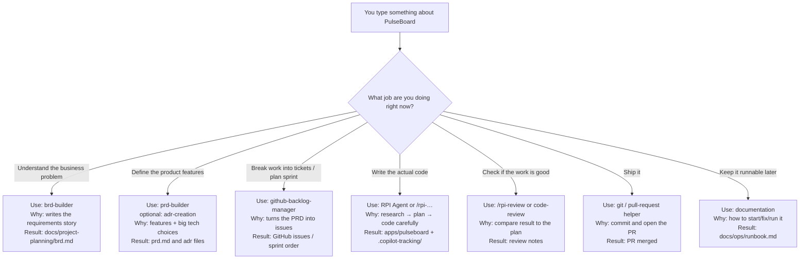

# HVE for beginners: lifecycle, jobs, and which agent to use

This guide assumes you know **nothing** about HVE yet.  
Read it top to bottom once. Then use it as a cheat sheet while we build **PulseBoard**.

---

## What is HVE in plain English?

**HVE Core** is a toolkit for GitHub Copilot in VS Code.

Instead of one generic chat that tries to do everything, HVE gives you **specialized helpers**:

| Kind | What it is | Everyday analogy |
| --- | --- | --- |
| **Agent** | A Copilot mode with a specific job (pick it from the agent dropdown) | Calling the right teammate: BA, PM, engineer, reviewer |
| **Skill / slash command** | A focused recipe you start with `/something` | A checklist for one task |
| **Instructions** | Auto-applied coding rules | Team coding standards on the wall |

**HVE Core All** (`hve-core-all`) is the full bundle of stable helpers.

> AI is fast at guessing. HVE makes it **slow down at the right moments** — understand the problem before coding, plan before implementing, review before calling work “done.”

---

## The big picture: the project lifecycle

Building software is not “open chat → write code.”  
HVE organizes work into **9 stages**:

```text
1 Setup
   ↓
2 Discovery          ← what problem are we solving?
   ↓
3 Product definition ← what exactly will we build?
   ↓
4 Decomposition      ← break it into tickets
   ↓
5 Sprint planning    ← what do we do first?
   ↓
6 Implementation     ← write the code (with RPI)
   ↓
7 Review             ← is it actually good enough?
   ↓
8 Delivery           ← merge, release
   ↓
9 Operations         ← keep it running / document it
```

You can loop (review finds bugs → back to implementation, and so on).

---

### Tiny story (PulseBoard) — how we learn HVE

We will learn every HVE idea by building one small app: **PulseBoard**.  
When you read a stage below, always ask: *“What does this mean for PulseBoard?”*

#### The problem

Small teams share daily status in chat (Teams / Slack / WhatsApp).

That breaks down:

- Updates get buried under other messages  
- “Who is blocked?” needs scrolling and guessing  
- Someone joining mid-day can’t see the full picture  

#### What PulseBoard does

PulseBoard is a **local-first team status board**.

Each person posts a short daily update:

- **Doing** — what I’m working on  
- **Blocked** — what’s stuck  
- **Next** — what I’ll do next  

The team opens one board and sees **today’s** updates together.

| In MVP | Out of MVP |
| --- | --- |
| Post doing / blocked / next | SSO / OAuth |
| Today’s board view | Notifications / Slack bots |
| Simple local identity | Mobile app |
| FastAPI + SQLite + HTMX | Multi-tenant SaaS |

#### How the 9 stages show up for PulseBoard

| Stage | What we do for PulseBoard |
| --- | --- |
| 1 Setup | Install HVE so Copilot can help us build PulseBoard |
| 2 Discovery | Write why chat status fails and what “good” looks like |
| 3 Product definition | Lock MVP features and tech choices |
| 4 Decomposition | Turn that into GitHub issues |
| 5 Sprint planning | First slice: post update + today’s board |
| 6 Implementation | Code the API and page with RPI |
| 7 Review | Check the board against requirements |
| 8 Delivery | Merge and tag `v0.1.0` |
| 9 Operations | Write how to start/fix PulseBoard |

Agents are just **the right helper for each PulseBoard chapter.**

---

## RPI in one minute (for PulseBoard coding later)

**RPI** = Research → Plan → Implement → Review.

When we build “post a status” or “show today’s board,” we won’t jump straight to code:

1. **Research** — how should this look in our repo?  
2. **Plan** — ordered steps with clear “done” checks  
3. **Implement** — write the code  
4. **Review** — does the board match acceptance criteria?  

**RPI Agent** = coding PulseBoard.  
**Not** for writing the BRD/PRD (those come earlier).

```text
brd / prd / adr helpers  →  decide what PulseBoard is
RPI Agent                →  build PulseBoard in the repo
```

---

## Stage-by-stage for PulseBoard

For every stage we show:

- **Input** — what you must have / give  
- **Output** — what “done” looks like  
- **Helper** — which HVE agent/skill  
- **Example prompt** — something you can paste  

---

### Stage 1 — Setup (for PulseBoard)

**For PulseBoard:** Install HVE helpers, empty folders, Python env — before any board features.

| | |
| --- | --- |
| **Input** | VS Code, GitHub Copilot, this repo; willingness to install **hve-core-all** |
| **Output** | Agent picker shows helpers (`brd-builder`, `RPI Agent`, …); folders `docs/`, `apps/pulseboard/` exist; conda `hve-env` (Python 3.12) works |
| **Helper** | Marketplace **HVE Core - All** (optional: `hve-core-installer` skill) |

**Example checks (not really a Copilot prompt):**

```text
1) Install extension: HVE Core - All
2) Reload VS Code → open Copilot Chat → confirm brd-builder and RPI Agent appear
3) conda activate hve-env && python --version   # expect 3.12.x
```

**Not output yet:** BRD, API, board UI.

---

### Stage 2 — Discovery (for PulseBoard)

**For PulseBoard:** Capture why chat status fails and what a good daily board means.

| | |
| --- | --- |
| **Input** | MVP framing (problem + in/out of scope). We already have `docs/project-planning/mvp-framing.md` |
| **Output** | `docs/project-planning/brd.md` with problem, users, success, in-scope, out-of-scope, open questions |
| **Helper** | **`brd-builder`** |

**Example prompt** (select agent `brd-builder`):

```text
Create a business requirements document for PulseBoard.

PulseBoard is a local-first team status board for small teams (~5–15 people).
People post daily updates: doing / blocked / next. A board shows today's updates
so standup context is not trapped in chat.

Objective: within two weeks, the team can replace ad-hoc standup chat with one
shared daily board.

Constraints:
- Local-first; SQLite is OK
- Simple identity only — no SSO in MVP
- No notifications, Slack, or mobile app in MVP
- Stack intent: Python FastAPI + SQLite + HTMX

Include problem statement, stakeholders, in/out of scope, success metrics,
assumptions, risks, and open questions.
Save to docs/project-planning/brd.md
```

**Not output yet:** Feature list at PRD depth, code, GitHub issues.

---

### Stage 3 — Product definition (for PulseBoard)

**For PulseBoard:** Turn the BRD into MVP features + locked tech choices.

| | |
| --- | --- |
| **Input** | Finished `docs/project-planning/brd.md` |
| **Output** | `docs/project-planning/prd.md`; ADRs (e.g. SQLite, simple identity); optional simple architecture diagram |
| **Helper** | **`prd-builder`**, then **`adr-creation`**, optional `architecture-diagrams` |

**Example prompt** (select `prd-builder`):

```text
Create a Product Requirements Document for PulseBoard MVP using
docs/project-planning/brd.md.

MVP must include:
- Post a status with doing / blocked / next
- View today's board
- Simple local identity (display name or demo login)

Write user stories with clear acceptance criteria.
Explicitly exclude SSO, notifications, and mobile.
Save to docs/project-planning/prd.md
```

**Example prompt** (select `adr-creation`):

```text
Create an ADR: choose SQLite over Postgres for PulseBoard MVP.
Context: local-first, single-machine, ~15 users.
Record decision, consequences, and when we would revisit.
Save under docs/project-planning/adr/
```

**Not output yet:** Running FastAPI app, GitHub issues.

---

### Stage 4 — Decomposition (for PulseBoard)

**For PulseBoard:** Split the PRD into small GitHub issues.

| | |
| --- | --- |
| **Input** | `docs/project-planning/prd.md` (and ADRs if useful) |
| **Output** | GitHub issues with labels + acceptance criteria (skeleton, create status, today’s board, identity, tests, …) |
| **Helper** | **`github-backlog-manager`** |

**Example prompt** (select `github-backlog-manager`):

```text
From docs/project-planning/prd.md, create GitHub issues for PulseBoard MVP.

Each issue needs:
- Clear title
- Acceptance criteria
- Label (api, ui, auth, docs, or tests)

Suggested breakdown:
1) App skeleton + health check
2) Create status (doing / blocked / next)
3) List today's board
4) Simple display name / demo login
5) Seed data + basic tests

Do not implement code — only create the issues.
```

**Not output yet:** Sprint order finalized, code.

---

### Stage 5 — Sprint planning (for PulseBoard)

**For PulseBoard:** Decide what we build first.

| | |
| --- | --- |
| **Input** | Open PulseBoard GitHub issues from Stage 4 |
| **Output** | Sprint 1 = post status + today’s board (vertical slice); Sprint 2 = harden/tests/docs; issues ordered or milestoned |
| **Helper** | **`github-backlog-manager`** (optional: `product-manager-advisor`) |

**Example prompt:**

```text
Using the open PulseBoard GitHub issues, propose Sprint 1 and Sprint 2.

Sprint 1 must be a thin vertical slice:
a user can post doing/blocked/next and see it on today's board.

Push polish, extra tests, and docs to Sprint 2.
Return the ordered issue list for each sprint.
```

**Not output yet:** Implemented features (that’s Stage 6).

---

### Stage 6 — Implementation (for PulseBoard)

**For PulseBoard:** Code one Sprint 1 issue at a time under `apps/pulseboard/`.

| | |
| --- | --- |
| **Input** | One GitHub issue + PRD acceptance criteria (+ prior `.copilot-tracking/` plan if continuing) |
| **Output** | Working code in `apps/pulseboard/`; evidence in `.copilot-tracking/` (research/plan/changes as used) |
| **Helper** | **`RPI Agent`** or `/rpi-research` → `/rpi-plan` → `/rpi-implement` |

**Example prompts:**

```text
/rpi-research

Research how to add a FastAPI endpoint to create a PulseBoard status
(doing, blocked, next) with SQLite in apps/pulseboard/.
Note existing repo patterns. Do not write production code yet.
```

```text
/rpi-plan

Plan implementation of GitHub issue #<N>: create status update.
Use the research findings. Include validation steps and acceptance checks
from the PRD. Do not implement yet.
```

```text
/rpi-implement

Implement approved plan for issue #<N> (create status).
Put code under apps/pulseboard/. Record changes in .copilot-tracking/.
```

Or with **RPI Agent**:

```text
Implement PulseBoard Sprint 1 issue #<N>: POST a status with doing/blocked/next
and show it on today's board. Follow RPI. Stack: FastAPI + SQLite + HTMX.
```

**Not output yet:** Formal accept/merge (Stages 7–8).

---

### Stage 7 — Review (for PulseBoard)

**For PulseBoard:** Check the board against what we promised.

| | |
| --- | --- |
| **Input** | Implemented code + plan/changes under `.copilot-tracking/` + issue/PRD acceptance criteria |
| **Output** | Review record: accept / defects / residual work; optional code-review notes |
| **Helper** | **`/rpi-review`**, then **`code-review`** |

**Example prompts:**

```text
/rpi-review

Review PulseBoard Sprint 1 against the plan and acceptance criteria:
1) User can post doing / blocked / next
2) Today's board shows those updates
Use .copilot-tracking/ evidence. Do not rewrite features unless listing follow-ups.
```

```text
(select code-review)

Review my local PulseBoard branch for Sprint 1 MVP.
Focus on correctness, Python/FastAPI basics, and obvious security issues
around input and identity.
```

**Not output yet:** Merged release (Stage 8).

---

### Stage 8 — Delivery (for PulseBoard)

**For PulseBoard:** Ship the MVP board to the shared branch.

| | |
| --- | --- |
| **Input** | Accepted (or accepted-with-follow-ups) Sprint 1 code on a feature branch |
| **Output** | PR opened and merged; tag `v0.1.0` |
| **Helper** | Git / pull-request prompts from HVE |

**Example prompt:**

```text
Create a pull request for PulseBoard Sprint 1 MVP.

Summarize:
- What: post status + today's board
- How validated: tests / manual checks / rpi-review outcome
- Out of scope: SSO, notifications, mobile

Then guide me to merge and tag v0.1.0 after approval.
```

---

### Stage 9 — Operations (for PulseBoard)

**For PulseBoard:** Make the shipped board runnable for the next person.

| | |
| --- | --- |
| **Input** | Merged MVP app under `apps/pulseboard/` + how you actually start it |
| **Output** | `docs/ops/runbook.md` (start/stop, DB path, common failures) |
| **Helper** | **`documentation`** |

**Example prompt** (select `documentation`):

```text
Author a runbook for PulseBoard at docs/ops/runbook.md.

Include:
- How to create/activate hve-env and start the app
- Where the SQLite file lives
- How to verify the board loads
- Common failures (port in use, missing deps, empty DB) and fixes
```

---

## Quick picker for PulseBoard

| I need to… for PulseBoard | Use this | Stage |
| --- | --- | --- |
| Get HVE helpers working | **hve-core-all** | 1 |
| Write why the board exists | **`brd-builder`** | 2 |
| Define board features / tech choices | **`prd-builder`**, **`adr-creation`** | 3 |
| Create GitHub issues for the board | **`github-backlog-manager`** | 4–5 |
| Code the board | **`RPI Agent`** | 6 |
| Check the board meets AC | `/rpi-review`, **`code-review`** | 7 |
| Merge the MVP | git / PR helpers | 8 |
| Write how to run the board | **`documentation`** | 9 |

---

## Common beginner mistakes (PulseBoard)

1. Using **RPI Agent** to write the PulseBoard BRD → use **`brd-builder`**.  
2. Using **`brd-builder`** to write FastAPI board code → finish Discovery/PRD first.  
3. Building polish before “post status + today’s board” works.  
4. Trusting chat history instead of files (`docs/project-planning/`, `.copilot-tracking/`).  

---

## Architecture of HVE Core (what happens when you type a prompt)

HVE is a box of **specialized helpers**.  
Each helper is a recipe. When you pick an agent (or type `/something`), Copilot opens **that** recipe — not the whole box.

```text
You type a prompt about PulseBoard
    → you pick one helper for your current job
    → Copilot loads that helper’s recipe
    → it writes a result into the PulseBoard project
```

### Side-by-side: same product, different stage ⇒ different files



**Idea:** your prompt alone is not enough — **the PulseBoard stage/job picks the helper**, and the helper picks what gets written.
