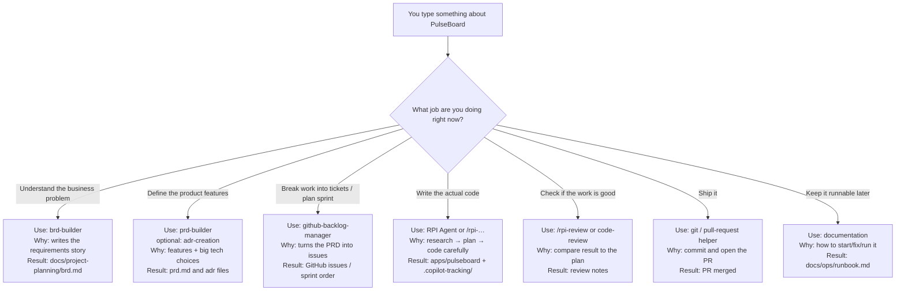

# HVE for beginners: lifecycle, jobs, and which agent to use

This guide assumes you know **nothing** about HVE yet.  
Read it top to bottom once. Then use the stage sections as a cheat sheet while we build PulseBoard.

---

## What is HVE in plain English?

**HVE Core** (Hypervelocity Engineering) is a toolkit for GitHub Copilot in VS Code.

Instead of one generic chat that tries to do everything, HVE gives you **specialized helpers**:

| Kind | What it is | Everyday analogy |
| --- | --- | --- |
| **Agent** | A Copilot mode with a specific job (pick it from the agent dropdown) | Calling the right teammate: BA, PM, engineer, reviewer |
| **Skill / slash command** | A focused recipe you start with `/something` | A checklist for one task |
| **Instructions** | Auto-applied coding rules | Team coding standards on the wall |

**HVE Core All** (`hve-core-all`) is the full bundle: you get essentially every stable helper.

Important idea:

> AI is fast at guessing. HVE is designed to make it **slow down at the right moments** — research before coding, plan before implementing, review before calling work “done.”

---

## The big picture: the project lifecycle

Building software is not “open chat → write code.”  
HVE organizes work into **9 stages**, like chapters of a project:

```text
1 Setup
   ↓
2 Discovery          ← what problem are we solving?
   ↓
3 Product definition ← what exactly will we build?
   ↓
4 Decomposition      ← break it into tickets
   ↓
5 Sprint planning    ← what do we do first?
   ↓
6 Implementation     ← write the code (with RPI)
   ↓
7 Review             ← is it actually good enough?
   ↓
8 Delivery           ← merge, release
   ↓
9 Operations         ← keep it running / document it
```

You can loop:

- Review finds bugs → go back to Implementation  
- Delivery finishes a sprint → next sprint’s Implementation  
- Ops finds an incident → hotfix via Implementation  

### Tiny story (PulseBoard)

Imagine your team’s daily status is scattered across chat.

1. **Setup** — install HVE so the helpers appear in Copilot  
2. **Discovery** — write down the business problem (“standup context is lost in chat”)  
3. **Product definition** — decide features for MVP (post doing/blocked/next, see today’s board)  
4. **Decomposition** — turn that into GitHub issues  
5. **Sprint planning** — pick the first vertical slice  
6. **Implementation** — build API + page using Research → Plan → Implement  
7. **Review** — check against the requirements  
8. **Delivery** — open PR, merge, tag `v0.1.0`  
9. **Operations** — write “how to run this” so others aren’t stuck  

That whole path is the lifecycle. Agents are just **the right helper for each chapter.**

---

## RPI in one minute (you will use this a lot)

**RPI** = Research → Plan → Implement → Review.

| Phase | Question it answers | Touches code? |
| --- | --- | --- |
| Research | What do we know / not know? | No (read-only) |
| Plan | What steps will we take? | No |
| Implement | Do the steps | Yes |
| Review | Did we meet acceptance criteria? | No (review-only) |

**RPI Agent** runs this lifecycle for a coding task.  
It is **not** the tool for writing a BRD or PRD. Those are earlier stages.

Memory hook:

```text
Builders (brd / prd / adr)  →  decide WHAT and WHY  (documents)
RPI Agent                   →  change the repo HOW  (code + evidence)
```

---

## Stage-by-stage map

For each stage below:

1. **Job** — what you are trying to accomplish  
2. **Purpose** — why this stage exists  
3. **HVE helpers** — which agent/skill to use and **why**  
4. **PulseBoard note** — what we do in this course  

---

### Stage 1 — Setup

**Job:** Get your tools working.  
**Purpose:** If agents don’t show up in Copilot, every later step fails in confusing ways. You are not building product yet.

| Use | Why |
| --- | --- |
| **`hve-core-installer`** (skill) | Helps install/configure HVE collections into a workspace the supported way |
| VS Code Marketplace: **HVE Core - All** | Fastest path to get all stable agents |

**Also do (human setup):** GitHub Copilot Chat installed, repo cloned, Python env ready (for us: conda `hve-env` with Python 3.12).

**PulseBoard:** Done. You can see RPI Agent; folders for docs/app exist.

---

### Stage 2 — Discovery

**Job:** Understand the **business problem**, who hurts, what “good” looks like, and what is out of scope.  
**Purpose:** Stops you from coding a clever solution to the wrong problem.

| Use | Why |
| --- | --- |
| **`brd-builder`** | Main agent here. Drafts a **Business Requirements Document** (problem, stakeholders, scope, success, risks) without jumping into UI widgets and API routes |
| **`dt-coach`** (optional) | If the problem is fuzzy and you need user-centered discovery (interviews, problem framing). Design Thinking before a BRD |
| **`/rpi-research`** (optional) | Only if you have a **specific unknown** that blocks decisions (e.g. “is SQLite enough for 15 users?”). Research is read-only evidence, not coding |
| **`security-planner`** / **`sssc-planner`** / **`rai-planner`** (optional early) | When security, supply-chain, or responsible-AI risk must shape requirements early. Skip for tiny MVPs unless relevant |
| **`experiment-designer`** (optional) | When you need a small experiment to validate an unknown before committing |

**PulseBoard:** Use **`brd-builder`** with our MVP framing. Save to `docs/project-planning/brd.md`.

---

### Stage 3 — Product definition

**Job:** Turn “we need a status board” into a concrete product spec and key design decisions.  
**Purpose:** The BRD says *why* and *what business outcome*. The PRD/ADRs say *what the product does* and *which technical choices we lock*.

| Use | Why |
| --- | --- |
| **`prd-builder`** | Builds a **Product Requirements Document**: features, user stories, acceptance criteria — still before big coding |
| **`product-manager-advisor`** | Helps prioritize and improve story quality if you’re unsure what is MVP vs later |
| **`adr-creation`** | Writes **Architecture Decision Records** (e.g. SQLite vs Postgres, how login works). Decisions stop being “lost in chat” |
| **`architecture-diagrams`** (skill) | Draws simple system pictures so everyone shares the same mental model |
| **`system-architecture-reviewer`** | Critiques the design for trade-offs before you invest in code |
| **`ux-ui-designer`** (optional) | Journeys, jobs-to-be-done, accessibility needs — research artifacts, not Figma pixels |

**PulseBoard:** `prd-builder` for MVP features; `adr-creation` for SQLite + simple identity; a small diagram.

---

### Stage 4 — Decomposition

**Job:** Break the PRD into trackable work items (issues/tickets).  
**Purpose:** A 20-page PRD does not get built. Small issues with acceptance criteria do.

| Use | Why |
| --- | --- |
| **`github-backlog-manager`** | Creates/triages GitHub issues from requirements; keeps backlog structured |
| **`ado-prd-to-wit`** / Azure DevOps backlog agents | Same idea if your team lives in Azure DevOps |
| **`jira-prd-to-wit`** / **`jira-backlog-manager`** | Same idea for Jira shops |

**PulseBoard:** Prefer **`github-backlog-manager`** (this course is on GitHub).

---

### Stage 5 — Sprint planning

**Job:** Choose what to build **now** vs later, in a sensible order.  
**Purpose:** Avoid starting with polish while the core board doesn’t work. Get a vertical slice first.

| Use | Why |
| --- | --- |
| **`github-backlog-manager`** | Orders issues, milestones, sprint-ish planning on GitHub |
| Agile coaching assets / **`product-manager-advisor`** | Helps you say no to scope creep and keep a thin MVP slice |

**PulseBoard:** Sprint 1 = post status + see today’s board. Sprint 2 = harden, tests, docs.

---

### Stage 6 — Implementation

**Job:** Actually change the codebase to deliver a planned slice.  
**Purpose:** This is where code appears — but still with evidence, not vibes.

| Use | Why |
| --- | --- |
| **`RPI Agent`** (or `/rpi` / `/rpi-quick`) | Coordinates Research → Plan → Implement → Review for a coding task, writing durable notes under `.copilot-tracking/` |
| **`/rpi-research`**, **`/rpi-plan`**, **`/rpi-implement`**, **`/rpi-review`** | Same lifecycle one phase at a time (great while learning) |
| **Coding standards instructions** (auto) | Keep Python/FastAPI style consistent without you restating rules every prompt |
| **`hve-builder`** (skill, optional) | Only when you want to create/improve custom HVE prompts/agents for your team |
| Data science generators (optional) | `gen-data-spec`, `gen-jupyter-notebook`, `gen-streamlit-dashboard` if the work is analytics/UI dashboards — not our MVP core |

**PulseBoard:** For each feature slice, use **RPI Agent** (or phase skills). Do **not** use `brd-builder` here.

---

### Stage 7 — Review

**Job:** Decide whether the work is acceptable, and route fixes.  
**Purpose:** “It runs on my machine” is not the same as “it meets the PRD / issue acceptance criteria.”

| Use | Why |
| --- | --- |
| **`/rpi-review`** | Compares implementation evidence to plan + acceptance criteria; records pass/fail style outcomes |
| **`code-review`** | Human-gated multi-perspective review (functional, standards, a11y, security, PR readiness) before you merge |
| **`security-reviewer`** | Looks for common vulnerabilities in the change (different from writing a full security plan) |

**PulseBoard:** `/rpi-review` against MVP AC, then `code-review` on the PR.

---

### Stage 8 — Delivery

**Job:** Land the change: commit, pull request, merge, tag/release.  
**Purpose:** Work isn’t delivered while it lives only on your laptop branch.

| Use | Why |
| --- | --- |
| Git prompts (`git-commit`, pull-request, `git-merge`, etc.) | Consistent commit/PR/merge hygiene instead of messy history |
| ADO build-info prompts (if ADO) | Check pipeline status when that’s your CI home |

**PulseBoard:** Open PR, merge MVP, tag `v0.1.0`.

---

### Stage 9 — Operations

**Job:** Keep the system understandable and recoverable after “it works.”  
**Purpose:** Future you (or a teammate) should start the app and fix common failures without archaeology.

| Use | Why |
| --- | --- |
| **`documentation`** | Audit/author/validate docs so README and runbooks don’t drift from reality |
| Incident-response style prompts | Practice “something broke — what do we do?” without waiting for a real outage |
| **`hve-builder`** (optional) | Codify repeatable ops prompts for your team |

**PulseBoard:** Write `docs/ops/runbook.md` (start/stop, DB file location, common errors).

---

## Quick picker: “I need to…” → use this

| I need to… | Use this | Stage |
| --- | --- | --- |
| Install HVE helpers | `hve-core-installer` / Marketplace **hve-core-all** | 1 |
| Write business requirements | **`brd-builder`** | 2 |
| Explore users/problems deeply | `dt-coach` | 2 |
| Research a technical unknown | `/rpi-research` | 2 or 6 |
| Write product/feature requirements | **`prd-builder`** | 3 |
| Record “we chose X over Y because…” | **`adr-creation`** | 3 |
| Draw the system | `architecture-diagrams` | 3 |
| Turn PRD into GitHub issues | **`github-backlog-manager`** | 4–5 |
| Build a feature in the repo | **`RPI Agent`** | 6 |
| Check if implementation matches the plan | `/rpi-review` | 7 |
| Get a pre-PR code review | **`code-review`** | 7 |
| Merge and release | git commit / PR / merge prompts | 8 |
| Write/maintain runbooks | **`documentation`** | 9 |

---

## Common beginner mistakes

1. **Using RPI Agent to write the BRD** — wrong tool; use `brd-builder`.  
2. **Using brd-builder to write FastAPI code** — wrong stage; finish Discovery/PRD first, then RPI.  
3. **Skipping Plan because “it’s a small change”** — small unclear changes create large messes; tiny *clear* edits can skip full RPI.  
4. **Treating chat history as memory** — HVE wants durable files (`docs/project-planning/`, `.copilot-tracking/`).  
5. **Installing only part of HVE and wondering where agents went** — for this course use **hve-core-all**.

---

## Where we are in the course right now

```text
[x] 1 Setup
[>] 2 Discovery   ← you are here → agent: brd-builder
[ ] 3 Product definition
[ ] 4 Decomposition
[ ] 5 Sprint planning
[ ] 6 Implementation   ← RPI Agent shows up here
[ ] 7 Review
[ ] 8 Delivery
[ ] 9 Operations
```

**Next action:** In VS Code, pick **`brd-builder`** (not RPI Agent), generate the PulseBoard BRD, save it under `docs/project-planning/`, then tell the coach `BRD DRAFTED`.

---

## Architecture of HVE Core (what happens when you type a prompt)

HVE is a box of **specialized helpers** for Copilot.  
Each helper is basically a recipe file. When you pick an agent (or type `/something`), Copilot opens **that** recipe — not the whole box.

Simple flow:

```text
You type a prompt
    → you also pick (or imply) one helper
    → Copilot loads that helper’s recipe
    → it writes a result into your project
```

Same product topic (“PulseBoard”) can mean totally different helpers depending on **which job you’re doing right now**.

### Side-by-side: same product, different stage ⇒ different files



**That’s the whole architecture idea:**  
your prompt alone is not enough — **the stage/job picks the helper**, and the helper picks what gets written.
