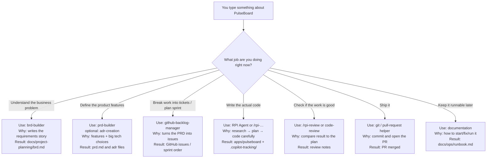

# HVE for beginners: lifecycle, jobs, and which agent to use

This guide assumes you know **nothing** about HVE yet.  
Read it top to bottom once. Then use it as a cheat sheet while we build **PulseBoard**.

---

## What is HVE in plain English?

**HVE Core** is a toolkit for GitHub Copilot in VS Code.

Instead of one generic chat that tries to do everything, HVE gives you **specialized helpers**:

| Kind | What it is | Everyday analogy |
| --- | --- | --- |
| **Agent** | A Copilot mode with a specific job (pick it from the agent dropdown) | Calling the right teammate: BA, PM, engineer, reviewer |
| **Skill / slash command** | A focused recipe you start with `/something` | A checklist for one task |
| **Instructions** | Auto-applied coding rules | Team coding standards on the wall |

**HVE Core All** (`hve-core-all`) is the full bundle of stable helpers.

> AI is fast at guessing. HVE makes it **slow down at the right moments** — understand the problem before coding, plan before implementing, review before calling work “done.”

---

## The big picture: the project lifecycle

Building software is not “open chat → write code.”  
HVE organizes work into **9 stages**:

```text
1 Setup
   ↓
2 Discovery          ← what problem are we solving?
   ↓
3 Product definition ← what exactly will we build?
   ↓
4 Decomposition      ← break it into tickets
   ↓
5 Sprint planning    ← what do we do first?
   ↓
6 Implementation     ← write the code (with RPI)
   ↓
7 Review             ← is it actually good enough?
   ↓
8 Delivery           ← merge, release
   ↓
9 Operations         ← keep it running / document it
```

You can loop (review finds bugs → back to implementation, and so on).

---

### Tiny story (PulseBoard) — how we learn HVE

We will learn every HVE idea by building one small app: **PulseBoard**.  
When you read a stage below, always ask: *“What does this mean for PulseBoard?”*

#### The problem

Small teams share daily status in chat (Teams / Slack / WhatsApp).

That breaks down:

- Updates get buried under other messages  
- “Who is blocked?” needs scrolling and guessing  
- Someone joining mid-day can’t see the full picture  

#### What PulseBoard does

PulseBoard is a **local-first team status board**.

Each person posts a short daily update:

- **Doing** — what I’m working on  
- **Blocked** — what’s stuck  
- **Next** — what I’ll do next  

The team opens one board and sees **today’s** updates together.

| In MVP | Out of MVP |
| --- | --- |
| Post doing / blocked / next | SSO / OAuth |
| Today’s board view | Notifications / Slack bots |
| Simple local identity | Mobile app |
| FastAPI + SQLite + HTMX | Multi-tenant SaaS |

#### How the 9 stages show up for PulseBoard

| Stage | What we do for PulseBoard |
| --- | --- |
| 1 Setup | Install HVE so Copilot can help us build PulseBoard |
| 2 Discovery | Write why chat status fails and what “good” looks like |
| 3 Product definition | Lock MVP features and tech choices |
| 4 Decomposition | Turn that into GitHub issues |
| 5 Sprint planning | First slice: post update + today’s board |
| 6 Implementation | Code the API and page with RPI |
| 7 Review | Check the board against requirements |
| 8 Delivery | Merge and tag `v0.1.0` |
| 9 Operations | Write how to start/fix PulseBoard |

Agents are just **the right helper for each PulseBoard chapter.**

---

## RPI in one minute (for PulseBoard coding later)

**RPI** = Research → Plan → Implement → Review.

When we build “post a status” or “show today’s board,” we won’t jump straight to code:

1. **Research** — how should this look in our repo?  
2. **Plan** — ordered steps with clear “done” checks  
3. **Implement** — write the code  
4. **Review** — does the board match acceptance criteria?  

**RPI Agent** = coding PulseBoard.  
**Not** for writing the BRD/PRD (those come earlier).

```text
brd / prd / adr helpers  →  decide what PulseBoard is
RPI Agent                →  build PulseBoard in the repo
```

---

## Stage-by-stage for PulseBoard

Each stage: **what it means for PulseBoard** → **why** → **which helper**.

---

### Stage 1 — Setup (for PulseBoard)

**For PulseBoard:** Get Copilot’s HVE helpers visible, create the empty PulseBoard folders, and ready Python (`hve-env` 3.12) for later FastAPI work.

**Why:** Later steps like “use brd-builder for PulseBoard” fail if the tools aren’t installed.

| Use | Why for PulseBoard |
| --- | --- |
| **HVE Core - All** extension | So `brd-builder`, `RPI Agent`, etc. appear |
| conda `hve-env` (Python 3.12) | Runtime for the board app later |
| Folders `docs/`, `apps/pulseboard/` | Where BRD, code, and runbook will live |

**Done when:** Helpers visible + folders ready. **No board features yet.**

---

### Stage 2 — Discovery (for PulseBoard)

**For PulseBoard:** Write the business story — chat standups lose doing/blocked/next; a shared daily board fixes that; SSO and notifications are out of scope.

**Why:** Without this, Copilot may invent Slack bots or a mobile app nobody asked for.

| Use | Why for PulseBoard |
| --- | --- |
| **`brd-builder`** | Drafts the PulseBoard BRD (problem, users, success, scope) |
| `/rpi-research` (only if needed) | e.g. “is local SQLite enough for ~15 people?” |

**Result:** `docs/project-planning/brd.md`  
**Not yet:** API routes, HTMX pages, database tables.

---

### Stage 3 — Product definition (for PulseBoard)

**For PulseBoard:** Turn “we need a status board” into MVP features and locked choices:

- Post doing / blocked / next  
- View today’s board  
- Simple local identity  
- FastAPI + SQLite + HTMX  

**Why:** The BRD says *why PulseBoard exists*. The PRD/ADRs say *exactly what we build first*.

| Use | Why for PulseBoard |
| --- | --- |
| **`prd-builder`** | Features + acceptance criteria for the board |
| **`adr-creation`** | Record “SQLite not Postgres,” “demo login not SSO” |
| **`architecture-diagrams`** | Picture: browser → FastAPI → SQLite |

**Result:** `prd.md`, ADR files, small diagram.  
**Not yet:** implementing `POST /statuses`.

---

### Stage 4 — Decomposition (for PulseBoard)

**For PulseBoard:** Split the PRD into GitHub issues, such as:

- App skeleton + health check  
- Create status update  
- List today’s board  
- Simple display name / demo login  
- Seed data + basic tests  

**Why:** “Build PulseBoard” is too big. Small issues with acceptance criteria are buildable.

| Use | Why for PulseBoard |
| --- | --- |
| **`github-backlog-manager`** | Creates those issues from the PRD |

**Result:** Labeled GitHub issues.  
**Not yet:** coding the board UI.

---

### Stage 5 — Sprint planning (for PulseBoard)

**For PulseBoard:** Choose order. Sprint 1 = thin slice **post a status → see it on today’s board**. Sprint 2 = tests, polish, docs.

**Why:** A fancy theme before the board lists updates wastes time.

| Use | Why for PulseBoard |
| --- | --- |
| **`github-backlog-manager`** | Order / milestone the issues |
| **`product-manager-advisor`** (optional) | Keep MVP thin |

**Result:** Sprint 1 = core board loop; Sprint 2 = harden.

---

### Stage 6 — Implementation (for PulseBoard)

**For PulseBoard:** Build the FastAPI app and HTMX board under `apps/pulseboard/`, one Sprint 1 issue at a time.

**Why:** First stage where PulseBoard becomes runnable. Still research/plan before big edits.

| Use | Why for PulseBoard |
| --- | --- |
| **`RPI Agent`** or `/rpi-research` → `/rpi-plan` → `/rpi-implement` | Build “create status” / “today’s board” carefully |
| Coding-standards instructions (auto) | Consistent Python while editing board code |

**Result:** Working local board + `.copilot-tracking/` notes.  
**Do not** use `brd-builder` here to rewrite the whole product story.

---

### Stage 7 — Review (for PulseBoard)

**For PulseBoard:** Can someone post doing/blocked/next and see today’s updates? Any quality/security issues before merge?

**Why:** “Server starts” ≠ “MVP acceptance criteria passed.”

| Use | Why for PulseBoard |
| --- | --- |
| **`/rpi-review`** | Compare board work to plan + AC |
| **`code-review`** | Pre-PR pass on the PulseBoard branch |
| **`security-reviewer`** (optional) | Check auth/input handling |

**Result:** Accept, or send fixes back to Implementation.

---

### Stage 8 — Delivery (for PulseBoard)

**For PulseBoard:** Land Sprint 1: PR, merge, tag `v0.1.0` so others can run the MVP board.

**Why:** A board that only works on your laptop isn’t delivered.

| Use | Why for PulseBoard |
| --- | --- |
| Git / pull-request helpers | Clean commit + PR for the MVP |

**Result:** Merged MVP, tagged release.

---

### Stage 9 — Operations (for PulseBoard)

**For PulseBoard:** Document how to start the app, where the SQLite file lives, and what to do if the board won’t load.

**Why:** After “it works,” the next person still needs a simple runbook.

| Use | Why for PulseBoard |
| --- | --- |
| **`documentation`** | Write/validate `docs/ops/runbook.md` |
| Incident-response style prompt (optional) | Practice “board returns 500 — now what?” |

**Result:** Runbook for start/stop/backup/common errors.

---

## Quick picker for PulseBoard

| I need to… for PulseBoard | Use this | Stage |
| --- | --- | --- |
| Get HVE helpers working | **hve-core-all** | 1 |
| Write why the board exists | **`brd-builder`** | 2 |
| Define board features / tech choices | **`prd-builder`**, **`adr-creation`** | 3 |
| Create GitHub issues for the board | **`github-backlog-manager`** | 4–5 |
| Code the board | **`RPI Agent`** | 6 |
| Check the board meets AC | `/rpi-review`, **`code-review`** | 7 |
| Merge the MVP | git / PR helpers | 8 |
| Write how to run the board | **`documentation`** | 9 |

---

## Common beginner mistakes (PulseBoard)

1. Using **RPI Agent** to write the PulseBoard BRD → use **`brd-builder`**.  
2. Using **`brd-builder`** to write FastAPI board code → finish Discovery/PRD first.  
3. Building polish before “post status + today’s board” works.  
4. Trusting chat history instead of files (`docs/project-planning/`, `.copilot-tracking/`).  

---

## Where we are right now

```text
[x] 1 Setup
[>] 2 Discovery   ← you are here → agent: brd-builder
[ ] 3 Product definition
[ ] 4 Decomposition
[ ] 5 Sprint planning
[ ] 6 Implementation   ← RPI Agent shows up here
[ ] 7 Review
[ ] 8 Delivery
[ ] 9 Operations
```

**Next action:** In VS Code, pick **`brd-builder`** (not RPI Agent), generate the PulseBoard BRD, save it under `docs/project-planning/`, then tell the coach `BRD DRAFTED`.

---

## Architecture of HVE Core (what happens when you type a prompt)

HVE is a box of **specialized helpers**.  
Each helper is a recipe. When you pick an agent (or type `/something`), Copilot opens **that** recipe — not the whole box.

```text
You type a prompt about PulseBoard
    → you pick one helper for your current job
    → Copilot loads that helper’s recipe
    → it writes a result into the PulseBoard project
```

### Side-by-side: same product, different stage ⇒ different files



**Idea:** your prompt alone is not enough — **the PulseBoard stage/job picks the helper**, and the helper picks what gets written.
