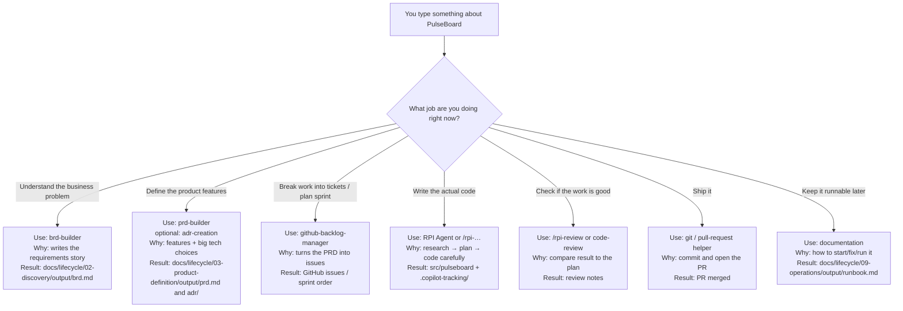

# Building PulseBoard with HVE — a beginner’s story

You don’t need to know HVE yet.  
Read this like a short story. By the end you should feel: *“I want to try this on a real project.”*

---

## 1. What we are trying to build

Meet **PulseBoard** — the app we’ll use to learn everything in this guide.

### The everyday problem

Small teams share daily status in chat (Teams, Slack, WhatsApp…).

It sounds fine — until it isn’t:

- Updates get buried under jokes, links, and other threads  
- “Who is blocked?” means scrolling and guessing  
- Someone joining mid-day can’t see the full picture  

Standup context lives in the wrong place: a noisy chat stream.

### What PulseBoard does

PulseBoard is a **local-first team status board**.

Each person posts a short daily update:

- **Doing** — what I’m working on  
- **Blocked** — what’s stuck  
- **Next** — what I’ll do next  

The team opens **one board** and sees **today’s** updates together.

| In our first version (MVP) | Not in MVP |
| --- | --- |
| Post doing / blocked / next | SSO / OAuth |
| Today’s board view | Notifications / Slack bots |
| Simple local identity | Mobile app |
| FastAPI + SQLite + HTMX | Big multi-tenant SaaS |

That’s the product.  
Now the real question: **how do people usually build something like this — and why does it often go sideways?**

---

## 2. How it used to be done (pre-HVE)

Long before specialized AI helpers, teams already had a sensible project lifecycle. It looked roughly like this:

```text
Setup the laptop and repo
   ↓
Discovery — talk about the problem
   ↓
Product definition — write requirements / specs
   ↓
Decomposition — break work into tickets
   ↓
Sprint planning — pick what to do first
   ↓
Implementation — write the code
   ↓
Review — someone checks the work
   ↓
Delivery — merge and release
   ↓
Operations — keep it running, write a runbook
```

For PulseBoard, the *human* version sounded like:

1. Install Python, create a repo  
2. Argue in a meeting about “status in Slack is broken”  
3. Someone writes a half-finished doc… or nobody does  
4. Tickets appear with titles like “build board” and no acceptance criteria  
5. A sprint starts with “let’s also add dark mode”  
6. An engineer (or a generic AI chat) jumps into FastAPI  
7. Review is “LGTM” if it runs locally  
8. Merge happens when people are tired  
9. Nobody writes how to start the app — until the next person is stuck  

The **stages were right**.  
The **discipline and memory** were fragile.

---

## 3. What’s hard about that lifecycle (the gaps HVE tries to fill)

The old lifecycle isn’t wrong. It’s just easy to break in practice — especially once AI enters the chat.

### Drawback 1 — Everything collapses into “just code it”

Discovery and planning feel slow. Coding feels productive.  
So people skip straight to Stage 6… and invent features (SSO! Slack bot! mobile!) that were never agreed.

### Drawback 2 — Knowledge lives in chat and brains

Decisions like “SQLite is fine for MVP” die in a meeting.  
Next week nobody remembers why. The AI definitely doesn’t.

### Drawback 3 — One generic assistant does every job badly

Ask a normal AI chat to “build PulseBoard” and it tries to be BA, PM, architect, coder, and reviewer **in one breath**.  
It optimizes for *plausible output*, not *verified progress*.

### Drawback 4 — “Done” means “it ran once on my machine”

Without clear acceptance criteria and a real review step, shipped software is hope with a README.

### Drawback 5 — The next human inherits a mystery

No runbook. No trail of why choices were made. Restarting costs days.

**HVE’s bet:** keep the same lifecycle chapters — but give you a **specialist helper for each chapter**, and force important thinking to become **files you can reopen**, not vibes you forget.

---

## 4. What is HVE in plain English?

**HVE Core** (Hypervelocity Engineering) is a toolkit that sits on top of **GitHub Copilot in VS Code**.

Think of it as a **crew**, not one intern:

| Kind of helper | What it is | Everyday analogy |
| --- | --- | --- |
| **Agent** | A Copilot mode with one job (pick it from the dropdown) | Calling the right teammate |
| **Skill / `/command`** | A focused recipe for one step | A checklist card |
| **Instructions** | Quiet coding rules that auto-apply | Standards on the wall |

**HVE Core All** (`hve-core-all`) is the full starter kit: you get the whole crew.

The big idea:

> AI is fast at guessing.  
> HVE makes it **slow down at the right moments** — understand PulseBoard before coding it, plan before implementing, review before calling it done.

When we *code*, we’ll use **RPI**: Research → Plan → Implement → Review.  
When we *define the product*, we’ll use builders like **`brd-builder`** and **`prd-builder`** — not the coding agent.

```text
brd / prd / adr helpers  →  decide what PulseBoard is
RPI Agent                →  build PulseBoard in the repo
```

---

## 5. The big picture: the project lifecycle (with HVE)

HVE doesn’t invent a weird new process.  
It **arms the same 9 stages** with the right helper:

```text
1 Setup              → get the HVE crew into VS Code
2 Discovery          → brd-builder writes why PulseBoard exists
3 Product definition → prd-builder + ADRs lock what we build
4 Decomposition      → github-backlog-manager creates issues
5 Sprint planning    → order a thin first slice
6 Implementation     → RPI Agent builds the board carefully
7 Review             → /rpi-review + code-review check “done”
8 Delivery           → PR, merge, tag v0.1.0
9 Operations         → documentation writes the runbook
```

Loops still happen: review finds bugs → back to implementation; ops finds a fire → hotfix via implementation.

For PulseBoard, the journey looks like this:

| Stage | What we do for PulseBoard |
| --- | --- |
| 1 Setup | Install HVE so Copilot can help |
| 2 Discovery | Write why chat status fails |
| 3 Product definition | Lock MVP features and tech choices |
| 4 Decomposition | Turn that into GitHub issues |
| 5 Sprint planning | First slice: post + today’s board |
| 6 Implementation | Code API + page with RPI |
| 7 Review | Check against requirements |
| 8 Delivery | Merge and tag `v0.1.0` |
| 9 Operations | Teach the next person how to run it |

---

## 6. Architecture of HVE Core (what happens when you type a prompt)

HVE is a box of **recipe files**.  
When you pick an agent (or type `/something`), Copilot opens **that** recipe — not the whole box.

```text
You type a prompt about PulseBoard
    → you pick one helper for your current job
    → Copilot loads that helper’s recipe
    → it writes a result into your project
```

Same topic (“PulseBoard”), different job ⇒ different helper:



That’s the magic trick: **the stage picks the teammate**, and the teammate picks what gets written.

---

## 7. Walk the PulseBoard journey stage by stage

Below is your playbook.  
Each stage has **Input → Output → Helper → Example prompt**.

---

### Stage 1 — Setup (for PulseBoard)

Get the crew into the room before anyone talks features.

| | |
| --- | --- |
| **Input** | VS Code, GitHub Copilot, this repo; install **hve-core-all** |
| **Output** | Agent picker shows helpers (`brd-builder`, `RPI Agent`, …); folders `docs/`, `src/pulseboard/`, `tests/` exist; conda `hve-env` (Python 3.12) works |
| **Helper** | Marketplace **HVE Core - All** |

**Example checks:**

```text
1) Install extension: HVE Core - All
2) Reload VS Code → Copilot Chat → confirm brd-builder and RPI Agent appear
3) conda activate hve-env && python --version   # expect 3.12.x
```

**Not yet:** BRD, API, board UI.

---

### Stage 2 — Discovery (for PulseBoard)

Write the *why* so we don’t accidentally build a Slack bot.

| | |
| --- | --- |
| **Input** | MVP framing (problem + in/out of scope), e.g. `docs/lifecycle/02-discovery/input/mvp-framing.md` |
| **Output** | `docs/lifecycle/02-discovery/output/brd.md` — problem, users, success, scope, open questions |
| **Helper** | **`brd-builder`** |

**Example prompt** (select `brd-builder`):

```text
Create a business requirements document for PulseBoard.

PulseBoard is a local-first team status board for small teams (~5–15 people).
People post daily updates: doing / blocked / next. A board shows today's updates
so standup context is not trapped in chat.

Objective: within two weeks, the team can replace ad-hoc standup chat with one
shared daily board.

Constraints:
- Local-first; SQLite is OK
- Simple identity only — no SSO in MVP
- No notifications, Slack, or mobile app in MVP
- Stack intent: Python FastAPI + SQLite + HTMX

Include problem statement, stakeholders, in/out of scope, success metrics,
assumptions, risks, and open questions.
Save to docs/lifecycle/02-discovery/output/brd.md
```

**Not yet:** Full PRD depth, code, tickets.

---

### Stage 3 — Product definition (for PulseBoard)

Turn “we need a board” into features and locked choices.

| | |
| --- | --- |
| **Input** | Finished `docs/lifecycle/02-discovery/output/brd.md` |
| **Output** | `docs/lifecycle/03-product-definition/output/prd.md`; ADRs under `.../output/adr/`; optional architecture diagram in the same `output/` folder |
| **Helper** | **`prd-builder`**, then **`adr-creation`**, optional `architecture-diagrams` |

**Example prompt** (`prd-builder`):

```text
Create a Product Requirements Document for PulseBoard MVP using
docs/lifecycle/02-discovery/output/brd.md.

MVP must include:
- Post a status with doing / blocked / next
- View today's board
- Simple local identity (display name or demo login)

Write user stories with clear acceptance criteria.
Explicitly exclude SSO, notifications, and mobile.
Save to docs/lifecycle/03-product-definition/output/prd.md
```

**Example prompt** (`adr-creation`):

```text
Create an ADR: choose SQLite over Postgres for PulseBoard MVP.
Context: local-first, single-machine, ~15 users.
Record decision, consequences, and when we would revisit.
Save under docs/lifecycle/03-product-definition/output/adr/
```

**Not yet:** Running app, GitHub issues.

---

### Stage 4 — Decomposition (for PulseBoard)

Make the work small enough to finish.

| | |
| --- | --- |
| **Input** | `docs/lifecycle/03-product-definition/output/prd.md` |
| **Output** | GitHub issues with labels + acceptance criteria |
| **Helper** | **`github-backlog-manager`** |

**Example prompt:**

```text
From docs/lifecycle/03-product-definition/output/prd.md, create GitHub issues for PulseBoard MVP.

Each issue needs:
- Clear title
- Acceptance criteria
- Label (api, ui, auth, docs, or tests)

Suggested breakdown:
1) App skeleton + health check
2) Create status (doing / blocked / next)
3) List today's board
4) Simple display name / demo login
5) Seed data + basic tests

Do not implement code — only create the issues.
```

---

### Stage 5 — Sprint planning (for PulseBoard)

Protect the thin slice: **post a status → see today’s board**.

| | |
| --- | --- |
| **Input** | Open PulseBoard issues |
| **Output** | Sprint 1 = vertical slice; Sprint 2 = harden/tests/docs |
| **Helper** | **`github-backlog-manager`** (optional: `product-manager-advisor`) |

**Example prompt:**

```text
Using the open PulseBoard GitHub issues, propose Sprint 1 and Sprint 2.

Sprint 1 must be a thin vertical slice:
a user can post doing/blocked/next and see it on today's board.

Push polish, extra tests, and docs to Sprint 2.
Return the ordered issue list for each sprint.
```

---

### Stage 6 — Implementation (for PulseBoard)

Now we code — still with Research → Plan → Implement.

| | |
| --- | --- |
| **Input** | One GitHub issue + PRD acceptance criteria |
| **Output** | Code in `src/pulseboard/` + evidence in `.copilot-tracking/` |
| **Helper** | **`RPI Agent`** or `/rpi-research` → `/rpi-plan` → `/rpi-implement` |

**Example prompts:**

```text
/rpi-research

Research how to add a FastAPI endpoint to create a PulseBoard status
(doing, blocked, next) with SQLite in src/pulseboard/.
Note existing repo patterns. Do not write production code yet.
```

```text
/rpi-plan

Plan implementation of GitHub issue #<N>: create status update.
Use the research findings. Include validation steps and acceptance checks
from the PRD. Do not implement yet.
```

```text
/rpi-implement

Implement approved plan for issue #<N> (create status).
Put code under src/pulseboard/. Record changes in .copilot-tracking/.
```

Or with **RPI Agent**:

```text
Implement PulseBoard Sprint 1 issue #<N>: POST a status with doing/blocked/next
and show it on today's board. Follow RPI. Stack: FastAPI + SQLite + HTMX.
```

---

### Stage 7 — Review (for PulseBoard)

“It runs” is not enough. Did we get the board we promised?

| | |
| --- | --- |
| **Input** | Code + `.copilot-tracking/` evidence + acceptance criteria |
| **Output** | Accept / defects / follow-ups; optional code-review notes |
| **Helper** | **`/rpi-review`**, then **`code-review`** |

**Example prompts:**

```text
/rpi-review

Review PulseBoard Sprint 1 against the plan and acceptance criteria:
1) User can post doing / blocked / next
2) Today's board shows those updates
Use .copilot-tracking/ evidence. Do not rewrite features unless listing follow-ups.
```

```text
(select code-review)

Review my local PulseBoard branch for Sprint 1 MVP.
Focus on correctness, Python/FastAPI basics, and obvious security issues
around input and identity.
```

---

### Stage 8 — Delivery (for PulseBoard)

Put the board where teammates can actually use the release.

| | |
| --- | --- |
| **Input** | Accepted Sprint 1 code on a branch |
| **Output** | PR merged; tag `v0.1.0` |
| **Helper** | Git / pull-request prompts |

**Example prompt:**

```text
Create a pull request for PulseBoard Sprint 1 MVP.

Summarize:
- What: post status + today's board
- How validated: tests / manual checks / rpi-review outcome
- Out of scope: SSO, notifications, mobile

Then guide me to merge and tag v0.1.0 after approval.
```

---

### Stage 9 — Operations (for PulseBoard)

Be kind to future you.

| | |
| --- | --- |
| **Input** | Merged app under `src/pulseboard/` + how you start it |
| **Output** | `docs/lifecycle/09-operations/output/runbook.md` |
| **Helper** | **`documentation`** |

**Example prompt:**

```text
Author a runbook for PulseBoard at docs/lifecycle/09-operations/output/runbook.md.

Include:
- How to create/activate hve-env and start the app
- Where the SQLite file lives
- How to verify the board loads
- Common failures (port in use, missing deps, empty DB) and fixes
```

---

## Quick picker (when you’re in the middle of the story)

| I need to… | Use this | Stage |
| --- | --- | --- |
| Get the crew working | **hve-core-all** | 1 |
| Write why the board exists | **`brd-builder`** | 2 |
| Define features / tech choices | **`prd-builder`**, **`adr-creation`** | 3 |
| Create issues / order the sprint | **`github-backlog-manager`** | 4–5 |
| Code the board | **`RPI Agent`** | 6 |
| Check “done” | `/rpi-review`, **`code-review`** | 7 |
| Ship it | git / PR helpers | 8 |
| Write the runbook | **`documentation`** | 9 |

**Avoid these plot twists:**

1. Using **RPI Agent** to write the BRD → wrong teammate; use **`brd-builder`**.  
2. Using **`brd-builder`** to write FastAPI → wrong chapter; finish Discovery/PRD first.  
3. Building polish before “post status + today’s board” works.  
4. Trusting chat history instead of files in `docs/lifecycle/` and `.copilot-tracking/`.

---

## Why this should make you want to try it

Imagine building PulseBoard the old way: a messy chat, a half-remembered decision, a burst of code, and a shrug for “done.”

Now imagine this instead:

- You pick **`brd-builder`** and the *why* becomes a real document  
- You pick **`prd-builder`** and the board’s MVP stops expanding forever  
- Issues appear with acceptance criteria — not vibes  
- **RPI** makes Copilot research and plan before it touches FastAPI  
- Review asks “does today’s board actually work?” before you merge  
- A runbook means the next person isn’t cursed  

Same lifecycle you already half-knew.  
A specialist for each chapter.  
Proof that lives in the repo.

That’s HVE.

If you’re curious: install **HVE Core - All**, open Copilot Chat, pick **`brd-builder`**, and paste the Stage 2 prompt.  
Watch the first durable PulseBoard artifact appear — and notice how different it feels from “hey AI, build me an app.”
