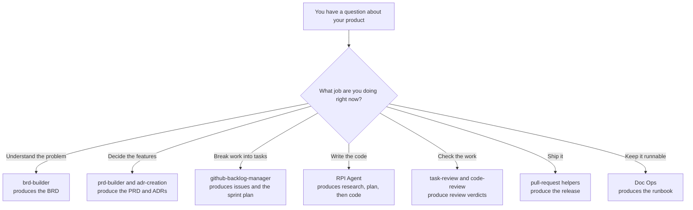

# Why this process exists

Optional reading. You can build your product without this page — the [stage pages](../../lifecycle/README.md) tell you what to do. This explains *why* they tell you to do it that way, which helps when you are tempted to skip a step.

If a word here is unfamiliar, check the [glossary](glossary.md).

---

## 1. The way software actually gets built

Long before AI helpers existed, teams already had a sensible sequence:

```text
Set up the machine and the repository
   ↓
Discovery — understand the problem
   ↓
Product definition — decide what to build
   ↓
Decomposition — break it into tasks
   ↓
Sprint planning — decide what comes first
   ↓
Implementation — write the code
   ↓
Review — check the work
   ↓
Delivery — release it
   ↓
Operations — keep it running
```

Nothing controversial. Those nine steps are the nine stages in this kit.

The stages were never the problem. What broke was the discipline and the memory: people skipped steps because coding felt more productive than thinking, and the reasons behind decisions lived in someone's head or a chat window until they evaporated.

## 2. What goes wrong, with or without AI

**Everything collapses into "just code it."** Discovery and planning feel slow; typing code feels like progress. So people jump straight to the implementation stage and invent features that were never agreed. Then a week is spent on something nobody wanted.

**Knowledge lives in chat and in heads.** "We decided a simple file would do instead of a database" is a real decision with real consequences. Next month nobody remembers why, and the AI never knew.

**One general assistant does every job badly.** Ask a plain AI chat to "build my app" and it tries to be analyst, product manager, architect, programmer, and reviewer in a single breath. It optimises for producing something plausible, not for producing something correct. It will not tell you it misunderstood — it will simply build the wrong thing, fluently.

**"Done" means "it ran once on my machine."** Without written acceptance criteria and a real review step, shipping is just hoping.

**The next person inherits a mystery.** No runbook, no record of decisions, so restarting costs days.

## 3. What this kit does about it

**A specialist for each stage.** Instead of one assistant doing everything, each stage has a helper built for that job. `brd-builder` will not start writing code. `RPI Agent` will not redesign your product. Picking the right helper matters more than the wording of your prompt.

**Important thinking becomes files, not chat.** Every stage writes a document into `lifecycle/`. Chat history disappears; those files do not. When the AI needs context three weeks later, it reads them.

**The AI is forced to slow down at the right moments.** When writing code, it must research and write down what it found, then write a plan, and only then write code — with you reading each step before allowing the next. A misunderstanding then costs you one paragraph of reading instead of three hundred lines of wrong code.

**Scope is written down and pointed at constantly.** Your framing document lists what is out of scope. Every prompt in this kit references it. That single habit prevents the most common failure mode.

## 4. How the helpers work

Three kinds of thing appear in this kit:

| Kind | What it is | Everyday equivalent |
| --- | --- | --- |
| **Helper** (agent, or mode) | A version of Copilot Chat set up for one job. Pick it from the dropdown. | Calling the right colleague |
| **Slash command** | A focused routine you trigger by typing `/something` | Following a recipe card |
| **Instructions** | Coding rules that apply quietly in the background | House style on the wall |

When you pick a helper and send a prompt, Copilot loads that helper's instructions rather than trying to be everything at once. Same question, different helper, completely different answer:



The stage picks the helper, and the helper decides what gets written.

## 5. Why the order matters

Each stage reads what the previous one wrote:

```text
your idea → the problem → the features → the tasks → the order
   → the code → the verdict → the release → the runbook
```

Skip a stage and the next one has nothing to read. It will either stop, or — worse — invent what it thinks should have been there. That invention is silent, confident, and usually wrong.

Going backwards is fine. Reviews find bugs, so you return to implementation. You learn something, so you update the framing and rework the definition. That is the process working, not failing.

## 6. The mistakes worth avoiding

1. **Using the coding helper to write requirements.** Wrong specialist. It will produce something that looks like a requirements document and reads like a technical design.
2. **Using a requirements helper to write code.** Same mistake, other direction. Finish the definition stages first.
3. **Building polish before the core works.** Your first sprint should be one thin path that a person could actually use, end to end. Beautiful settings screens attached to nothing are the classic trap.
4. **Trusting the chat instead of the files.** If it matters, it belongs in `lifecycle/`.
5. **Letting scope grow quietly.** Every "while we're here, let's also…" costs you the release. If you want it, edit the framing document first and see how you feel about it in writing.
6. **Ticking a review box you did not check.** The reviews only protect you if you are honest in them.

## 7. Why it is worth the effort

Building without this looks like: a messy chat, a half-remembered decision, a burst of AI-generated code, and a shrug for "done".

Building with it looks like: the reasons written down where you can reread them, a feature list that stops growing, tasks with clear finish lines, an AI that investigates before it types, a review that asks whether the thing actually works, and a runbook so the next person is not stranded.

Same nine stages you already half-knew. A specialist for each one. Proof that lives in the repository.

Ready? Go back to the [main README](../../README.md) and start with Stage 1.
