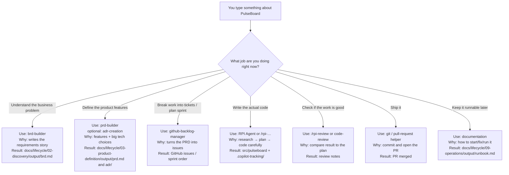

# Building PulseBoard with HVE — a beginner’s story

You don’t need to know HVE yet.  
Read this like a short story. By the end you should feel: *“I want to try this on a real project.”*

---

## 1. What we are trying to build

Meet **PulseBoard** — the app we’ll use to learn everything in this guide.

### The everyday problem

Small teams share daily status in chat (Teams, Slack, WhatsApp…).

It sounds fine — until it isn’t:

- Updates get buried under jokes, links, and other threads  
- “Who is blocked?” means scrolling and guessing  
- Someone joining mid-day can’t see the full picture  

Standup context lives in the wrong place: a noisy chat stream.

### What PulseBoard does

PulseBoard is a **local-first team status board**.

Each person posts a short daily update:

- **Doing** — what I’m working on  
- **Blocked** — what’s stuck  
- **Next** — what I’ll do next  

The team opens **one board** and sees **today’s** updates together.

| In our first version (MVP) | Not in MVP |
| --- | --- |
| Post doing / blocked / next | SSO / OAuth |
| Today’s board view | Notifications / Slack bots |
| Simple local identity | Mobile app |
| FastAPI + SQLite + HTMX | Big multi-tenant SaaS |

That’s the product.  
Now the real question: **how do people usually build something like this — and why does it often go sideways?**

---

## 2. How it used to be done (pre-HVE)

Long before specialized AI helpers, teams already had a sensible project lifecycle. It looked roughly like this:

```text
Setup the laptop and repo
   ↓
Discovery — talk about the problem
   ↓
Product definition — write requirements / specs
   ↓
Decomposition — break work into tickets
   ↓
Sprint planning — pick what to do first
   ↓
Implementation — write the code
   ↓
Review — someone checks the work
   ↓
Delivery — merge and release
   ↓
Operations — keep it running, write a runbook
```

For PulseBoard, the *human* version sounded like:

1. Install Python, create a repo  
2. Argue in a meeting about “status in Slack is broken”  
3. Someone writes a half-finished doc… or nobody does  
4. Tickets appear with titles like “build board” and no acceptance criteria  
5. A sprint starts with “let’s also add dark mode”  
6. An engineer (or a generic AI chat) jumps into FastAPI  
7. Review is “LGTM” if it runs locally  
8. Merge happens when people are tired  
9. Nobody writes how to start the app — until the next person is stuck  

The **stages were right**.  
The **discipline and memory** were fragile.

---

## 3. What’s hard about that lifecycle (the gaps HVE tries to fill)

The old lifecycle isn’t wrong. It’s just easy to break in practice — especially once AI enters the chat.

### Drawback 1 — Everything collapses into “just code it”

Discovery and planning feel slow. Coding feels productive.  
So people skip straight to Stage 6… and invent features (SSO! Slack bot! mobile!) that were never agreed.

### Drawback 2 — Knowledge lives in chat and brains

Decisions like “SQLite is fine for MVP” die in a meeting.  
Next week nobody remembers why. The AI definitely doesn’t.

### Drawback 3 — One generic assistant does every job badly

Ask a normal AI chat to “build PulseBoard” and it tries to be BA, PM, architect, coder, and reviewer **in one breath**.  
It optimizes for *plausible output*, not *verified progress*.

### Drawback 4 — “Done” means “it ran once on my machine”

Without clear acceptance criteria and a real review step, shipped software is hope with a README.

### Drawback 5 — The next human inherits a mystery

No runbook. No trail of why choices were made. Restarting costs days.

**HVE’s bet:** keep the same lifecycle chapters — but give you a **specialist helper for each chapter**, and force important thinking to become **files you can reopen**, not vibes you forget.

---

## 4. What is HVE in plain English?

**HVE Core** (Hypervelocity Engineering) is a toolkit that sits on top of **GitHub Copilot in VS Code**.

Think of it as a **crew**, not one intern:

| Kind of helper | What it is | Everyday analogy |
| --- | --- | --- |
| **Agent** | A Copilot mode with one job (pick it from the dropdown) | Calling the right teammate |
| **Skill / `/command`** | A focused recipe for one step | A checklist card |
| **Instructions** | Quiet coding rules that auto-apply | Standards on the wall |

**HVE Core All** (`hve-core-all`) is the full starter kit: you get the whole crew.

The big idea:

> AI is fast at guessing.  
> HVE makes it **slow down at the right moments** — understand PulseBoard before coding it, plan before implementing, review before calling it done.

When we *code*, we’ll use **RPI**: Research → Plan → Implement → Review.  
When we *define the product*, we’ll use builders like **`brd-builder`** and **`prd-builder`** — not the coding agent.

```text
brd / prd / adr helpers  →  decide what PulseBoard is
RPI Agent                →  build PulseBoard in the repo
```

---

## 5. The big picture: the project lifecycle (with HVE)

HVE doesn’t invent a weird new process.  
It **arms the same 9 stages** with the right helper:

```text
1 Setup              → get the HVE crew into VS Code
2 Discovery          → brd-builder writes why PulseBoard exists
3 Product definition → prd-builder + ADRs lock what we build
4 Decomposition      → github-backlog-manager creates issues
5 Sprint planning    → order a thin first slice
6 Implementation     → RPI Agent builds the board carefully
7 Review             → /rpi-review + code-review check “done”
8 Delivery           → PR, merge, tag v0.1.0
9 Operations         → documentation writes the runbook
```

Loops still happen: review finds bugs → back to implementation; ops finds a fire → hotfix via implementation.

For PulseBoard, the journey looks like this:

| Stage | What we do for PulseBoard |
| --- | --- |
| 1 Setup | Install HVE so Copilot can help |
| 2 Discovery | Write why chat status fails |
| 3 Product definition | Lock MVP features and tech choices |
| 4 Decomposition | Turn that into GitHub issues |
| 5 Sprint planning | First slice: post + today’s board |
| 6 Implementation | Code API + page with RPI |
| 7 Review | Check against requirements |
| 8 Delivery | Merge and tag `v0.1.0` |
| 9 Operations | Teach the next person how to run it |

---

## 6. Architecture of HVE Core (what happens when you type a prompt)

HVE is a box of **recipe files**.  
When you pick an agent (or type `/something`), Copilot opens **that** recipe — not the whole box.

```text
You type a prompt about PulseBoard
    → you pick one helper for your current job
    → Copilot loads that helper’s recipe
    → it writes a result into your project
```

Same topic (“PulseBoard”), different job ⇒ different helper:



That’s the magic trick: **the stage picks the teammate**, and the teammate picks what gets written.

---

## 7. Walk the PulseBoard journey stage by stage

Below is your playbook.  
Each stage has **Input → Output → Helper → Example prompt**.

**How to use these prompts (HVE-effective):**

1. Select the named **agent** (or type the `/skill`) *before* pasting.  
2. Keep prompts **one job only** — never ask `brd-builder` to write FastAPI.  
3. Point at **real paths** in this repo (`docs/lifecycle/...`, `src/pulseboard/`).  
4. Save durable files into that stage’s **`output/`** (copy/link into the next stage’s **`input/`** when useful).  
5. Between RPI phases, `/clear` (or new chat) and attach the previous artifact.

---

### Stage 1 — Setup (for PulseBoard)

Get the crew into the room before anyone talks features.

| | |
| --- | --- |
| **Input** | VS Code, GitHub Copilot, this repo; install **hve-core-all** |
| **Output** | Helpers visible; lifecycle folders present; conda `hve-env` (Python 3.12); optional `01-setup/output/setup-verification.md` |
| **Helper** | Marketplace **HVE Core - All** (optional: `documentation`) |

**Manual checks:**

```text
1) Install: HVE Core - All (ise-hve-essentials.hve-core-all)
2) Developer: Reload Window
3) Copilot Chat agent picker shows: brd-builder, prd-builder, RPI Agent, github-backlog-manager
4) conda activate hve-env && python --version   # expect 3.12.x
5) Confirm docs/lifecycle/01-setup … 09-operations each have input/ and output/
```

**Optional prompt** (select **`documentation`**):

```text
Author a short Setup verification note for PulseBoard.

Context:
- Repo layout: docs/lifecycle/<stage>/{input,output}/ and src/pulseboard/
- Tooling: HVE Core All + GitHub Copilot in VS Code
- Runtime: conda env hve-env, Python 3.12

Write docs/lifecycle/01-setup/output/setup-verification.md with:
- Agents confirmed in the picker
- Python version check + expected result
- Explicit statement: no product features implemented in Setup

Stop conditions:
- Do not create a BRD, PRD, GitHub issues, or application code
```

**Not yet:** BRD, API, board UI.

---

### Stage 2 — Discovery (for PulseBoard)

Write the *why* so we don’t accidentally build a Slack bot.

| | |
| --- | --- |
| **Input** | `docs/lifecycle/02-discovery/input/mvp-framing.md` |
| **Output** | `docs/lifecycle/02-discovery/output/brd.md` |
| **Helper** | **`brd-builder`** — solution-agnostic business requirements only |

**Example prompt** (select **`brd-builder`**):

```text
Create a Business Requirements Document for PulseBoard.

Binding inputs (read first, do not contradict):
- docs/lifecycle/02-discovery/input/mvp-framing.md

Business intent (do NOT design APIs, schemas, or UI widgets):
PulseBoard helps small teams (~5–15 people) replace ad-hoc daily standup chat
with one shared board of “doing / blocked / next” updates for today.

Primary objective (measurable):
Within two weeks of use, the team can answer “who is blocked today?” from the
board alone, without scrolling standup chat threads.

Stakeholders to cover:
- Individual contributor posting status
- Tech lead / teammate scanning the board
- Repo maintainer running it locally

Hard MVP out-of-scope (must appear explicitly):
- SSO / OAuth
- Notifications, email, Slack/Teams bots
- Mobile apps
- Multi-tenant SaaS hosting
- Real-time websockets

Stack intent (assumption only, not a design):
Python FastAPI + SQLite + HTMX, local-first.

Required BRD sections:
1) Problem statement and current-state pain
2) Goals / non-goals
3) Stakeholders and needs
4) In-scope vs out-of-scope for MVP
5) Success metrics and acceptance signals
6) Assumptions, dependencies, risks
7) Open questions that would block Product Definition (if any)

Quality bar:
- Solution-agnostic outcomes (not endpoints/tables/components)
- Explicit refusals beat vague “nice to have”
- Clear enough that prd-builder can work without re-discovering the problem

Write the final document to:
docs/lifecycle/02-discovery/output/brd.md

Stop when saved. Do not create a PRD, ADRs, issues, or code.
```

**Optional** — only if a real unknown blocks Discovery (`/rpi-research`):

```text
/rpi-research

Task slug: pulseboard-discovery-sqlite-fit
Question: For a local-first board used by ~15 people on one machine, is SQLite
adequate for daily status posts (doing/blocked/next), or is Postgres required in MVP?

Rules:
- Read-only research; no implementation
- Separate evidence from assumptions
- Prefer this repo’s docs plus well-known SQLite characteristics

Deliverables:
- Standard .copilot-tracking/research/ artifact if the skill requires it
- Summary copy: docs/lifecycle/02-discovery/output/sqlite-mvp-research.md

Stop after research. Do not plan or implement.
```

**Not yet:** PRD-depth features, code, tickets.

---

### Stage 3 — Product definition (for PulseBoard)

Turn “we need a board” into features and locked choices.

| | |
| --- | --- |
| **Input** | `docs/lifecycle/02-discovery/output/brd.md` |
| **Output** | `.../03-product-definition/output/prd.md`, `.../output/adr/`, optional diagram |
| **Helper** | **`prd-builder`** → **`adr-creation`** → optional **`architecture-diagrams`** |

**Example prompt** (select **`prd-builder`**):

```text
Create a Product Requirements Document for the PulseBoard MVP.

Sources of truth (must not contradict):
- docs/lifecycle/02-discovery/output/brd.md
- docs/lifecycle/02-discovery/input/mvp-framing.md

MVP capabilities (each needs user stories + testable acceptance criteria):
1) Post today’s status with fields: doing, blocked, next
2) View today’s board (all updates for the current day)
3) Simple local identity (recommend display name OR demo login — pick one)

For every story include:
- Actor
- Narrative
- Testable acceptance criteria (Given/When/Then or checkbox AC)
- Story-level non-goals

Prioritization:
- Must / Should / Could (MVP vs later)
- Name the thinnest vertical slice: “post status → appears on today’s board”

Technical direction to reflect (not a full design doc):
- Package root: src/pulseboard/
- FastAPI + SQLite + HTMX
- Local-first single process

Repeat these non-goals in the PRD:
SSO, notifications, Slack/Teams bots, mobile, multi-tenant SaaS, websockets.

Write:
docs/lifecycle/03-product-definition/output/prd.md

Also write a short handoff for Decomposition:
docs/lifecycle/04-decomposition/input/prd-handoff.md
(PRD path + list of Must stories)

Stop. Do not create GitHub issues or application code.
```

**Example prompt** (select **`adr-creation`**) — data store:

```text
Create an Architecture Decision Record for PulseBoard MVP storage.

Decision to document:
Accept SQLite for MVP instead of Postgres.

Context:
- docs/lifecycle/02-discovery/output/brd.md
- docs/lifecycle/03-product-definition/output/prd.md (if present)
- Local-first, one machine, ~15 users, low write volume

ADR must include:
- Status: Accepted for MVP
- Context
- Options considered (at least SQLite vs Postgres)
- Decision
- Consequences (positive and negative)
- Revisit triggers

Save:
docs/lifecycle/03-product-definition/output/adr/0001-sqlite-for-mvp.md

Coaching questions are OK; finish with a complete ADR file.
Do not implement database code.
```

**Example prompt** (select **`adr-creation`**) — identity:

```text
Create ADR 0002 for PulseBoard MVP identity.

Lean decision (confirm or improve with trade-offs):
Simple display-name identity for MVP (no SSO).

Compare at least:
- Display name only
- Local username/password
- OAuth/SSO (reject for MVP with rationale)

Save:
docs/lifecycle/03-product-definition/output/adr/0002-simple-identity-for-mvp.md
```

**Example prompt** (`architecture-diagrams` skill):

```text
Create a simple C4 container diagram for PulseBoard MVP.

Containers:
- Browser (HTMX)
- FastAPI app (src/pulseboard/)
- SQLite file on local disk

Show a single-machine trust boundary.
Exclude cloud services, SSO, and message buses.

Save Mermaid markdown to:
docs/lifecycle/03-product-definition/output/architecture-container.md
```

**Not yet:** Running app, GitHub issues.

---

### Stage 4 — Decomposition (for PulseBoard)

Make the work small enough to finish.

| | |
| --- | --- |
| **Input** | `docs/lifecycle/03-product-definition/output/prd.md` (+ ADRs) |
| **Output** | GitHub issues with AC; `04-decomposition/output/backlog-snapshot.md` |
| **Helper** | **`github-backlog-manager`** |

**Example prompt** (select **`github-backlog-manager`**):

```text
Decompose the PulseBoard MVP into GitHub issues.

Read first:
- docs/lifecycle/03-product-definition/output/prd.md
- docs/lifecycle/03-product-definition/output/adr/
- docs/lifecycle/04-decomposition/input/prd-handoff.md (if present)

Target system:
FastAPI + SQLite + HTMX app under src/pulseboard/

Every issue MUST have:
- Imperative title
- Link/reference to PRD capability
- Testable acceptance criteria
- One label from: api, ui, auth, db, tests, docs
- Size hint S or M (split anything larger)

Seed backlog (keep intent; rename freely):
1) App skeleton + health check
2) SQLite schema + persistence for status updates
3) Create status (doing / blocked / next)
4) Today’s board view
5) Simple display-name identity (ADR 0002)
6) Seed data + basic automated tests
7) README quickstart (may land in Sprint 2)

Rules:
- Prefer one vertical concern per issue
- Do NOT implement code
- Do NOT expand into SSO, notifications, or mobile

After issues exist, write:
docs/lifecycle/04-decomposition/output/backlog-snapshot.md
Include issue numbers/URLs, titles, labels, and AC summaries.
```

---

### Stage 5 — Sprint planning (for PulseBoard)

Protect the thin slice: **post a status → see today’s board**.

| | |
| --- | --- |
| **Input** | Open issues + `04-decomposition/output/backlog-snapshot.md` |
| **Output** | `05-sprint-planning/output/sprint-plan.md` |
| **Helper** | **`github-backlog-manager`** (optional: **`product-manager-advisor`**) |

**Example prompt** (select **`github-backlog-manager`**):

```text
Create Sprint 1 and Sprint 2 plans for PulseBoard.

Inputs:
- Open GitHub issues
- docs/lifecycle/04-decomposition/output/backlog-snapshot.md

Sprint 1 objective (non-negotiable):
A user with a display name can submit doing/blocked/next and see that update
on today’s board in the local app.

Sprint 1 rules:
- Include only issues required for that vertical slice
- Suggested order: skeleton → persistence → create status → today’s board → identity
- Exclude polish, broad test matrix, and extra docs unless required for the demo

Sprint 2:
- Hardening, broader tests, README/runbook prep, remaining non-slice MVP items

Deliver:
1) Milestone or label issues as sprint-1 / sprint-2 when tools allow
2) Write docs/lifecycle/05-sprint-planning/output/sprint-plan.md containing:
   - Ordered Sprint 1 issues + why each is required for the slice
   - Ordered Sprint 2 issues
   - Explicit “not in Sprint 1” list
   - Sprint 1 Definition of Done (demo script: post → board shows it)

Do not write application code.
```

**Optional** (select **`product-manager-advisor`**):

```text
Challenge docs/lifecycle/05-sprint-planning/output/sprint-plan.md for scope creep.

Question: What is the smallest issue set that still demos
“post doing/blocked/next → visible on today’s board”?
Recommend cuts only. Do not add features.
```

---

### Stage 6 — Implementation (for PulseBoard)

Code one Sprint 1 issue at a time with Research → Plan → Implement.

| | |
| --- | --- |
| **Input** | One Sprint 1 issue + PRD AC + ADRs |
| **Output** | `src/pulseboard/` + `.copilot-tracking/` + notes in `06-implementation/output/` |
| **Helper** | `/rpi-research` → `/rpi-plan` → `/rpi-implement` (or **`RPI Agent`**) |

Replace `#N` with the real issue number. **One issue per RPI cycle.**  
`/clear` between phases and attach the previous artifact.

**Research:**

```text
/rpi-research

Task slug: pulseboard-issue-N-create-status
Goal: Evidence to implement GitHub issue #N for PulseBoard create-status
(doing/blocked/next) without inventing repo conventions.

Inspect:
- src/pulseboard/
- tests/
- pyproject.toml
- docs/lifecycle/03-product-definition/output/prd.md
- docs/lifecycle/03-product-definition/output/adr/0001-sqlite-for-mvp.md
- docs/lifecycle/03-product-definition/output/adr/0002-simple-identity-for-mvp.md

Questions:
1) What package/module layout should new FastAPI code follow?
2) How should SQLite be created/opened for MVP simplicity?
3) What validation rules are implied by the issue/PRD acceptance criteria?
4) What test patterns already exist?

Rules:
- Read-only; no production code changes
- Separate evidence from assumptions
- If evidence is already adequate, state that and avoid redundant research

Persist the skill’s .copilot-tracking/research/ artifact, and write:
docs/lifecycle/06-implementation/output/issue-N-research-summary.md
```

**Plan:**

```text
/rpi-plan

Task slug: pulseboard-issue-N-create-status
Plan GitHub issue #N (create PulseBoard status).

Inputs:
- Research path: <paste .copilot-tracking research file>
- docs/lifecycle/03-product-definition/output/prd.md
- docs/lifecycle/05-sprint-planning/output/sprint-plan.md

Plan must include:
- Stable Pxx / Pxx-Txx IDs
- Exact files to add/change under src/pulseboard/ and tests/
- Validation commands
- Traceability from tasks → issue/PRD acceptance criteria
- Boundaries: do not implement unrelated board features unless issue #N requires them
- Independent critique disposition before implementation readiness

Do not implement code.
Persist plan/details/critique under .copilot-tracking/, and write:
docs/lifecycle/06-implementation/output/issue-N-plan-pointer.md
```

**Implement:**

```text
/rpi-implement

Task slug: pulseboard-issue-N-create-status
Execute ONLY approved scope <Pxx or Pxx-Txx> for issue #N.

Bindings:
- Plan: <path>
- Phase details: <path>
- Critique disposition: Pass (handle amendments first if not Pass)

Rules:
- Code in src/pulseboard/; tests in tests/
- Honor ADR 0001 (SQLite) and ADR 0002 (simple identity) if touched
- Record changes + validation evidence under .copilot-tracking/changes/
- On material divergence: DIV/AM per RPI, then stop for re-critique
- No Sprint 2 scope creep

When validation succeeds, write:
docs/lifecycle/06-implementation/output/issue-N-done.md
```

**All-in-one alternative** (select **`RPI Agent`**):

```text
Run a full RPI lifecycle for PulseBoard GitHub issue #N.

Paste issue title + acceptance criteria below:
<paste>

Stack and locations:
- FastAPI + SQLite + HTMX
- Code: src/pulseboard/
- Constraints: docs/lifecycle/03-product-definition/output/prd.md and adr/

RPI requirements:
- Assess research readiness; research only for demonstrated gaps
- Plan + critique before code
- Implement only approved scope
- Validate with explicit commands
- Keep durable artifacts in .copilot-tracking/
- Final status note: docs/lifecycle/06-implementation/output/issue-N-done.md

Out of scope: SSO, notifications, mobile, unrelated refactors.
```

---

### Stage 7 — Review (for PulseBoard)

“It runs” is not enough. Did we get the board we promised?

| | |
| --- | --- |
| **Input** | Code + `.copilot-tracking/` + Sprint 1 DoD / PRD AC |
| **Output** | `docs/lifecycle/07-review/output/` |
| **Helper** | **`/rpi-review`**, then **`code-review`** |

**Example prompt** (`/rpi-review`):

```text
/rpi-review

Task slug: pulseboard-sprint-1-mvp
Acceptance review for PulseBoard Sprint 1.

Compare against:
- docs/lifecycle/05-sprint-planning/output/sprint-plan.md
- docs/lifecycle/03-product-definition/output/prd.md
- .copilot-tracking/ evidence for Sprint 1 issues
- src/pulseboard/ working tree

Acceptance gates:
1) Simple display-name identity works (ADR 0002)
2) User can post doing / blocked / next
3) Today’s board shows that update without using chat
4) Validations claimed in change logs are present and sufficient

Rules:
- Review-only: do not modify product code
- Keep execution status separate from outcome
- Identify findings as RV-xxx with severity and routed follow-ups

Write:
- .copilot-tracking/reviews/logs/ artifact (skill standard)
- docs/lifecycle/07-review/output/sprint-1-rpi-review.md
```

**Example prompt** (select **`code-review`**):

```text
Run a human-gated code review of the current local branch for PulseBoard Sprint 1.

Product context:
- Local-first status board
- FastAPI + SQLite + HTMX in src/pulseboard/
- DoD: docs/lifecycle/05-sprint-planning/output/sprint-plan.md

Perspectives:
- Functional correctness vs Sprint 1 DoD
- Python/FastAPI maintainability
- Security: injection, display-name trust, DB file path safety, secret leakage
- PR readiness

Depth: standard
Confirm scope with me before dispatching subagents if the agent requires it.

Write one deduplicated report to:
docs/lifecycle/07-review/output/sprint-1-code-review.md

Do not implement fixes; list ordered follow-ups only.
```

---

### Stage 8 — Delivery (for PulseBoard)

Put the board where teammates can use the release.

| | |
| --- | --- |
| **Input** | Accepted Sprint 1 (`07-review/output/`); clean branch |
| **Output** | PR + merge + tag `v0.1.0`; `08-delivery/output/v0.1.0-release-notes.md` |
| **Helper** | HVE git / pull-request prompts |

**Example prompt:**

```text
Deliver PulseBoard Sprint 1 MVP.

Preflight (report before changing remotes):
- Disposition in docs/lifecycle/07-review/output/sprint-1-rpi-review.md
- Critical code-review items resolved or explicitly deferred
- Tests and/or documented 3-step demo pass

Then:
1) Open/update a PR that includes:
   - Summary: display name + post doing/blocked/next + today’s board
   - Validation evidence (commands + review artifact paths)
   - Out of scope: SSO, notifications, mobile
   - Reviewer test plan (post → appears on board)
2) Guide merge to the default branch after approval
3) Tag v0.1.0
4) Write docs/lifecycle/08-delivery/output/v0.1.0-release-notes.md

Do not start Sprint 2 feature work in this step.
```

---

### Stage 9 — Operations (for PulseBoard)

Be kind to future you.

| | |
| --- | --- |
| **Input** | Shipped `src/pulseboard/` + real start commands |
| **Output** | `docs/lifecycle/09-operations/output/runbook.md` |
| **Helper** | **`documentation`** |

**Example prompt** (select **`documentation`**):

```text
Author the operations runbook for PulseBoard v0.1.0.

Inspect before writing:
- README.md
- pyproject.toml
- src/pulseboard/
- docs/lifecycle/08-delivery/output/v0.1.0-release-notes.md (if present)
- docs/lifecycle/03-product-definition/output/adr/

Write:
docs/lifecycle/09-operations/output/runbook.md

Required sections:
1) Purpose and audience
2) Prerequisites (hve-env / Python 3.12, ports)
3) Install or update dependencies
4) Start and stop (exact commands)
5) SQLite file location + backup/restore
6) Smoke test: post a status and confirm today’s board
7) Common failures and fixes (port in use, missing deps, empty/locked DB, wrong env)
8) Explicit MVP limits (local-first; not a multi-tenant service)

Quality bar:
- Commands are copy-pastable
- Do not invent unshipped features
- Mark any unverified command as UNVERIFIED

Optional: if README quickstart drifts, align it to this runbook.
Keep the runbook as the operations source of truth.
```

---

## Quick picker (when you’re in the middle of the story)

| I need to… | Use this | Stage |
| --- | --- | --- |
| Get the crew working | **hve-core-all** | 1 |
| Write why the board exists | **`brd-builder`** | 2 |
| Define features / tech choices | **`prd-builder`**, **`adr-creation`** | 3 |
| Create issues / order the sprint | **`github-backlog-manager`** | 4–5 |
| Code the board | **`RPI Agent`** | 6 |
| Check “done” | `/rpi-review`, **`code-review`** | 7 |
| Ship it | git / PR helpers | 8 |
| Write the runbook | **`documentation`** | 9 |

**Avoid these plot twists:**

1. Using **RPI Agent** to write the BRD → wrong teammate; use **`brd-builder`**.  
2. Using **`brd-builder`** to write FastAPI → wrong chapter; finish Discovery/PRD first.  
3. Building polish before “post status + today’s board” works.  
4. Trusting chat history instead of files in `docs/lifecycle/` and `.copilot-tracking/`.

---

## Why this should make you want to try it

Imagine building PulseBoard the old way: a messy chat, a half-remembered decision, a burst of code, and a shrug for “done.”

Now imagine this instead:

- You pick **`brd-builder`** and the *why* becomes a real document  
- You pick **`prd-builder`** and the board’s MVP stops expanding forever  
- Issues appear with acceptance criteria — not vibes  
- **RPI** makes Copilot research and plan before it touches FastAPI  
- Review asks “does today’s board actually work?” before you merge  
- A runbook means the next person isn’t cursed  

Same lifecycle you already half-knew.  
A specialist for each chapter.  
Proof that lives in the repo.

That’s HVE.

If you’re curious: install **HVE Core - All**, open Copilot Chat, pick **`brd-builder`**, and paste the Stage 2 prompt.  
Watch the first durable PulseBoard artifact appear — and notice how different it feels from “hey AI, build me an app.”
